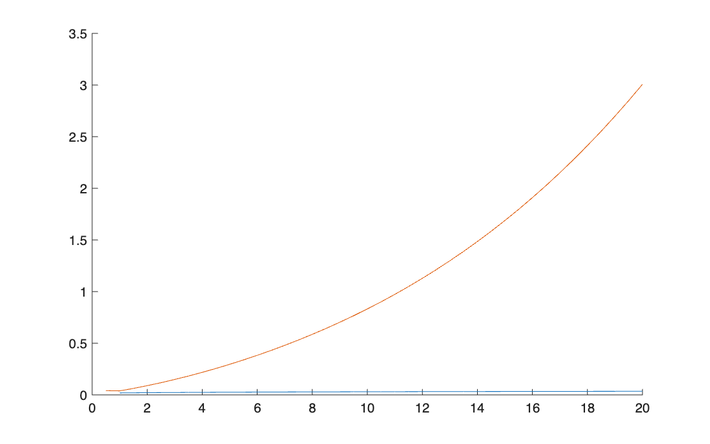
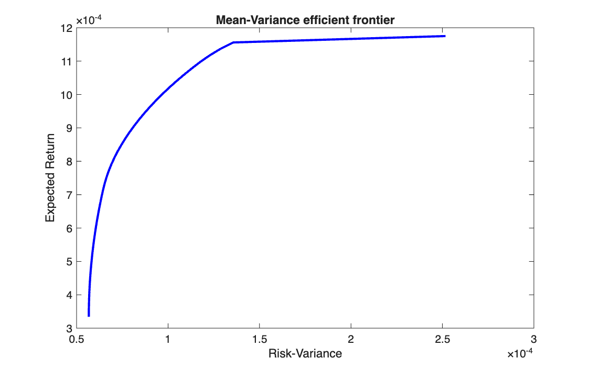

# Written exam, 23 June 2026

<p class="ex-meta">Computational Finance · exam session of 23 June 2026</p>

Three tasks, solved in MATLAB under exam conditions: a yield curve from swap rates, a
mean-variance and mean-MAD frontier, and the price of a European option with three methods.

The code below is **exactly as submitted**. The only changes are the removal of the header line
with my student details, the translation of the comments into English, and the removal of the
blank line that followed every line of code in the saved files. It was not reviewed
before publication; the errors found on review are listed at the end of the page, with the
correct numbers, instead of being fixed in the code.

## Task 1 · Yield curve from IRS rates

Bootstrap the discount factors from 20 annual swap rates (1.92% at 1 year to 4.09% at 20 years),
interpolate the yields on a half-yearly grid, and plot spot and forward rates.

=== "S_IRS.m"

    ```matlab
    --8<-- "computational-finance/exams/exam-2026-06-23/S_IRS.m"
    ```

=== "F_Bootstrap.m"

    ```matlab
    --8<-- "computational-finance/exams/exam-2026-06-23/F_Bootstrap.m"
    ```

=== "F_StructInterYield.m"

    ```matlab
    --8<-- "computational-finance/exams/exam-2026-06-23/F_StructInterYield.m"
    ```

=== "F_forward.m"

    ```matlab
    --8<-- "computational-finance/exams/exam-2026-06-23/F_forward.m"
    ```

The chart as the submitted code produces it: the continuous spot curve (blue, almost flat at
this scale) and the "forward rates" (orange), which climb to 300%.



## Task 2 · Mean-variance and mean-MAD frontiers

On 12 EURO STOXX 50 stocks and 289 returns, build the mean-variance efficient frontier with
45 target returns, then the mean-MAD frontier.

=== "S_Markowitz.m"

    ```matlab
    --8<-- "computational-finance/exams/exam-2026-06-23/S_Markowitz.m"
    ```

The mean-variance part runs: the frontier goes from the minimum-variance portfolio (mean
return 0.033% per period, variance $5.7 \times 10^{-5}$, 9 stocks) to the best single stock (0.118%).



The mean-MAD part (point 7) stops with an error; see below.

## Task 3 · European option: Monte Carlo, binomial tree, Black–Scholes

Price a two-year call and put with $S_0 = 85$, $K = 90$, $r = 6\%$, $\sigma = 40\%$, by Monte Carlo
(100,000 draws), on a 24-step binomial tree, and with the Black–Scholes formula.

=== "S_OptionPricing.m"

    ```matlab
    --8<-- "computational-finance/exams/exam-2026-06-23/S_OptionPricing.m"
    ```

=== "F_Montecarlo.m"

    ```matlab
    --8<-- "computational-finance/exams/exam-2026-06-23/F_Montecarlo.m"
    ```

=== "F_Binomiale.m"

    ```matlab
    --8<-- "computational-finance/exams/exam-2026-06-23/F_Binomiale.m"
    ```

| | Monte Carlo | Binomial tree, 24 steps | Black–Scholes as submitted | Black–Scholes, correct |
|---|---:|---:|---:|---:|
| Call | 20.9285 | 21.1284 | 49.2335 | 21.0519 |
| Put | 15.8648 | 15.9512 | 49.2335 | 15.8748 |

Monte Carlo and the tree agree with the correct closed form; the submitted formula does not.

## Errors found on review

| Task | Where | What is wrong | Effect | Correct result |
|---|---|---|---|---|
| 1 | `F_Bootstrap` | `z` is made a row and repeated down the rows, so the matrix has $A_{ij} = z_j$ instead of $z_i$: each equation uses the other maturities' rates | the curve is too low | 20-year spot 4.22% (annual), not 3.53% |
| 1 | `F_forward` | the first forward rate uses `forward_prices(k)`, the last one, instead of `forward_prices(1)`; the others use the spot price `v(k)` instead of the forward price | "forward rates" rise to 300% | forward rates between 2.6% and 5.0% |
| 1 | `F_StructInterYield` | the 6-month point is before the first maturity (1 year) and is not extrapolated | the curves start at 1 year | minor |
| 2 | point 7 | the loop runs over the 100 targets of `eta_2` but reads `eta(k)`, which has 45 | stops at $k = 46$ with "Index exceeds the number of array elements" | — |
| 2 | point 7 | `linprog` is asked only for the solution vector, so `Risk_MAD_` stores weights and auxiliary variables, not the MAD; `Risk_MAD_(1:n)` then takes the first $n$ entries of one column | even without the index error, the plotted "risk" would not be the MAD | the MAD is the second output of `linprog` |
| 3 | Black–Scholes | `d_1` is divided by `sigma` and then multiplied by `sqrt(T)` instead of divided by `sigma*sqrt(T)`; the prices use `d_1` and `d_2` directly instead of $N(d_1)$ and $N(d_2)$ | call = put = 49.23 | call 21.0519, put 15.8748 |

The comment in `S_OptionPricing.m` says the binomial tree does not give the put price. When the
code is run, it does: 15.9512, equal to the put-call parity check.

The correct formulas for all three tasks are on the course pages:
[bootstrapping](../../part-1/swap-rate-bootstrapping/index.md),
[spot and forward curve](../../part-1/yield-curve-from-irs/index.md),
[mean-MAD frontier](../../part-2/mean-mad-frontier/index.md),
[binomial tree](../../part-3/binomial-tree/index.md).
