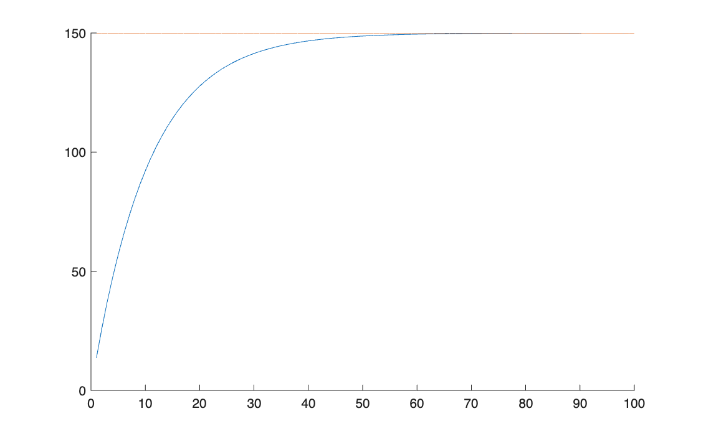
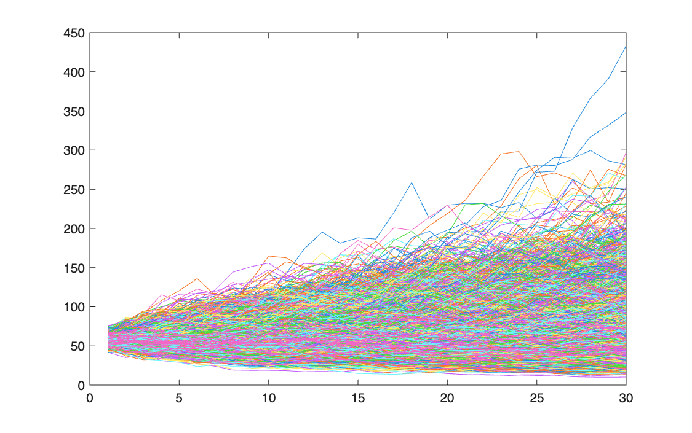

# Written exam, 16 July 2026

<p class="ex-meta">Computational Finance · exam session of 16 July 2026</p>

Three tasks, solved in MATLAB under exam conditions: the value of an annuity, a European call
priced with Black–Scholes and with Monte Carlo, and a MinMax efficient frontier.

The code below is **exactly as submitted**. The only changes are the removal of the header line
with my student details, the translation of the comments into English, and the removal of the
blank line that followed every line of code in the saved files. It was not reviewed
before publication; the problems found on review are listed at the end of the page, with the
correct numbers, instead of being fixed in the code.

## Task 1 · Present value of an annuity

An annuity pays 15 a year for 20 years at 10%. Compute its value with the closed form, with a
function and with a loop, then plot the value against the number of payments.

=== "S_Annuity.m"

    ```matlab
    --8<-- "computational-finance/exams/exam-2026-07-16/S_Annuity.m"
    ```

=== "F_Annuity.m"

    ```matlab
    --8<-- "computational-finance/exams/exam-2026-07-16/F_Annuity.m"
    ```

The three methods agree: **127.7035**. The perpetuity value, the asymptote, is $R/i = 150$.



## Task 2 · European call: Black–Scholes against Monte Carlo

Price a two-year call with $S_0 = 57$, $K = 62$, $r = 9\%$, $\sigma = 32\%$, with the closed form
and by simulating 10,000 paths of 30 steps.

=== "S_MCvsBS.m"

    ```matlab
    --8<-- "computational-finance/exams/exam-2026-07-16/S_MCvsBS.m"
    ```

=== "F_formulaBS.m"

    ```matlab
    --8<-- "computational-finance/exams/exam-2026-07-16/F_formulaBS.m"
    ```

=== "F_Montecarlo_def.m"

    ```matlab
    --8<-- "computational-finance/exams/exam-2026-07-16/F_Montecarlo_def.m"
    ```

The closed form gives **12.5577**, which is correct. The Monte Carlo function returns 30 numbers,
rising from 0.38 to 12.47, instead of one price; see below.



## Task 3 · MinMax efficient frontier

On 10 NASDAQ-100 stocks and 289 returns, build the frontier that minimises the worst loss for
each target return, and plot the number of stocks selected.

=== "S_MinMax.m"

    ```matlab
    --8<-- "computational-finance/exams/exam-2026-07-16/S_MinMax.m"
    ```

With current MATLAB the script stops at the frontier loop; see below. With that one call
fixed, the model is right: the worst loss goes from **7.85%** for the minimum-risk portfolio
(2 stocks, mean return 0.108% per period) to **18.45%** for the best single stock (0.374%), and
the number of stocks falls from 2 to 1 as the target return rises, as the comment in the code
says.

## Problems found on review

| Task | Where | What is wrong | Effect | Correct result |
|---|---|---|---|---|
| 2 | `F_Montecarlo_def` | the payoff is averaged over the whole $n \times m$ matrix of paths instead of the final prices `S_T(:, end)` | 30 "prices", one per time step, all discounted as if they matured at $T$ | the last one, 12.4676, is the Monte Carlo price, within simulation error of 12.5577 |
| 3 | frontier loop | `linprog(f, A, b, Aeq_, beq_, LB, [], [], options)` passes a starting point (the second `[]`) before the options; current MATLAB releases reject it ("does not accept X0") | the script stops; no frontier is plotted | worst loss from 7.85% to 18.45%, as above |
| 3 | `xlswrite` | `xlswrite('FrontieraMinMax.xls', 'eta', 'var_port')` writes the text `'eta'` into a sheet named `var_port` | the results are not saved | `xlswrite(file, [eta; var_port])` |

Task 1 and the Black–Scholes function of task 2 are correct as submitted.
