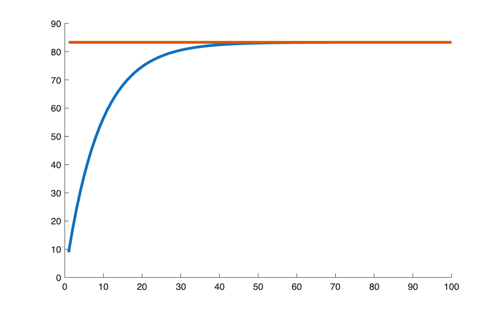

# Present value of an annuity

<p class="ex-meta">Course exercise 49 · Part I</p>

## Problem

Compute the present value of an annuity paying 10 a year for 17 years at 12%, first with a
loop and then with the closed form. Then plot how the value changes with the number of
payments, up to 100.

## Method

$$
V_0 = \sum_{k=1}^{n} R\, v^k = R\, v\, \frac{1 - v^n}{1 - v}, \qquad v = \frac{1}{1+i}
$$

As $n \to \infty$ the annuity becomes a perpetuity, worth $R / i$.

## Code

=== "S_exercise_49.m"

    ```matlab
    --8<-- "computational-finance/part-1/annuity-present-value/S_exercise_49.m"
    ```

## Results

Loop and closed form agree: $V_0 = 71.1963$. The perpetuity value is $R/i = 83.33$.



## Takeaways

- The closed form is a geometric series; the loop is a way to check it.
- Adding payments adds less and less value: at 12%, the 17-year annuity is already worth 85%
  of a perpetuity.
