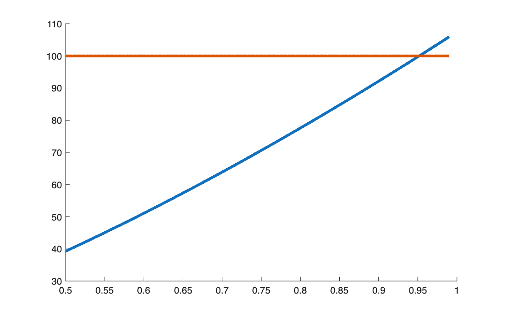

# Internal rate of return

<p class="ex-meta">Course exercise 57 · Part I</p>

## Problem

An investment costs 100 and pays 2.5 after 6 and 12 months and 102.5 after 18 months. Find its
internal rate of return numerically, and show graphically where the solution lies.

## Method

The IRR is the rate that sets the present value of all flows, cost included, to zero. Working
with the discount factor $v = 1/(1 + i)$, it is the root of:

$$
g(v) = \sum_k x_k\, v^{t_k} = 0, \qquad IRR = \frac{1}{v^*} - 1
$$

The root is found with `fzero`. For the chart, the same condition is split in two:
the value of the future flows, $f(v) = \sum_{k \ge 1} x_k v^{t_k}$, must equal the cost,
100. The IRR sits where the two curves cross.

## Code

=== "S_exercise_57.m"

    ```matlab
    --8<-- "computational-finance/part-1/internal-rate-of-return/S_exercise_57.m"
    ```

## Results

$v^* = 0.9518$, so **IRR = 5.0625%** a year.



## Takeaways

- The result can be checked by hand: 2.5 every six months on 100 is 2.5% per half-year, and
  $1.025^2 - 1 = 5.0625\%$.
- Solving in $v$ instead of $i$ turns the problem into finding the root of a polynomial-like
  function, which `fzero` handles from any reasonable starting point.
