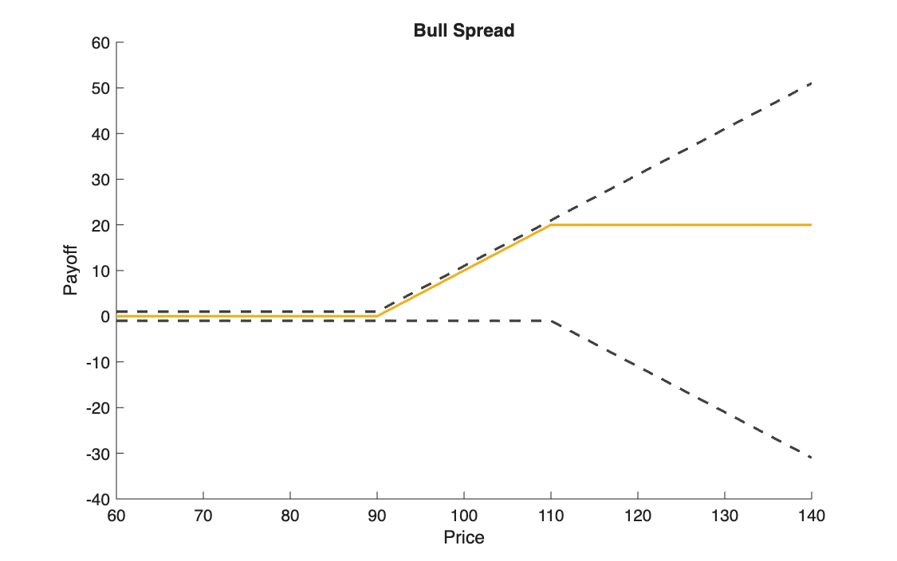
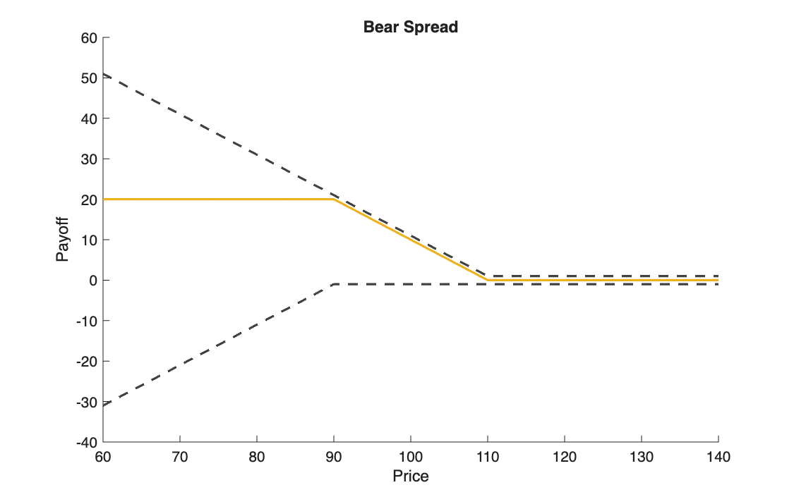
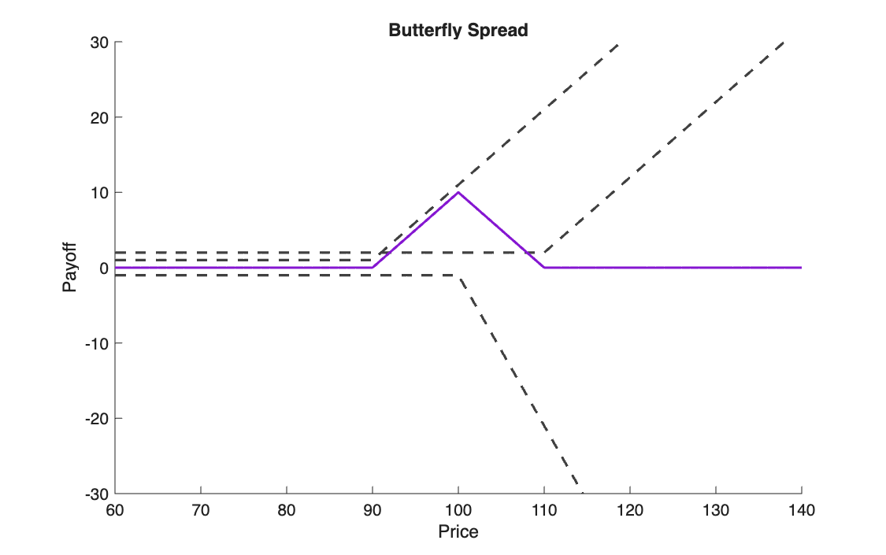
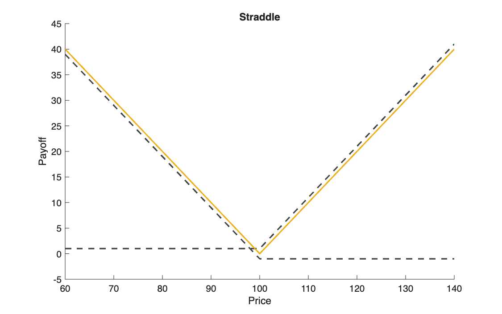
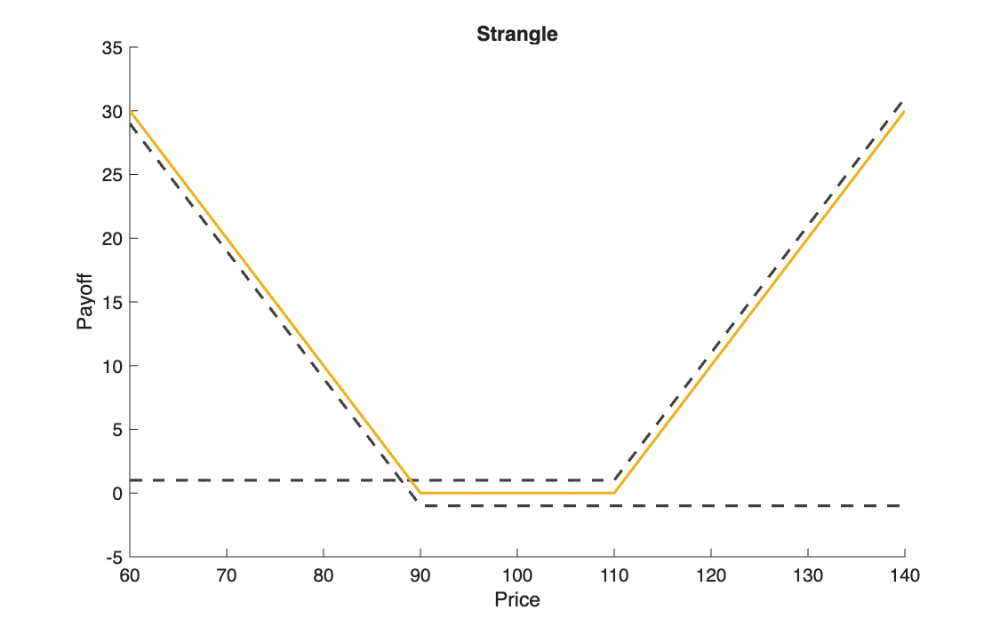

# Payoffs of option strategies

<p class="ex-meta">Course exercise 39 · Part I</p>

## Problem

Plot the payoff at maturity of five classic option strategies, built from European calls and
puts: bull spread, bear spread, butterfly spread, straddle and strangle.

## Method

At maturity, with underlying price $S$ and strike $K$:

$$
c(S) = \max(S - K,\, 0), \qquad p(S) = \max(K - S,\, 0)
$$

Each strategy is a sum of these, long (+) or short (−):

| Strategy | Construction | View |
|---|---|---|
| Bull spread | $+c(K_1) - c(K_2)$ | moderate rise |
| Bear spread | $+p(K_2) - p(K_1)$ | moderate fall |
| Butterfly | $+c(K_1) - 2\,c(K_2) + c(K_3)$ | price stays near $K_2$ |
| Straddle | $+c(K) + p(K)$ | large move, either direction |
| Strangle | $+p(K_1) + c(K_2)$ | very large move, cheaper |

## Code

=== "MATLAB"

    === "S_exercise_39.m"

        ```matlab
        --8<-- "computational-finance/part-1/option-strategy-payoffs/S_exercise_39.m"
        ```

=== "Python"

    === "S_exercise_39.py"

        ```python
        --8<-- "computational-finance/part-1/option-strategy-payoffs/S_exercise_39.py"
        ```

## Results

The solid line is the strategy; the dashed lines are its components, shifted up or down by one or
two units so that they do not overlap.

=== "Bull spread"

    

=== "Bear spread"

    

=== "Butterfly"

    

=== "Straddle"

    

=== "Strangle"

    

## Takeaways

- These are payoffs, not profits: the premiums paid and received are not included.
- The spreads cap both gain and loss at $K_2 - K_1 = 20$; the butterfly peaks at
  $K_2 - K_1 = 10$ exactly at $S = K_2$.
- Straddle and strangle are bets on volatility, not direction: the strangle needs a bigger
  move, because nothing pays between $K_1$ and $K_2$.
