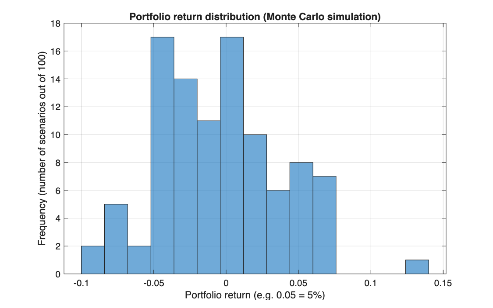

# Portfolio value under scenarios and Monte Carlo VaR

<p class="ex-meta">Course exercise 31 · Part I</p>

## Problem

A portfolio holds five stocks, with current prices $P_0$ and share quantities $q$. Given a
matrix of three return scenarios, compute the portfolio value and return in each one. Then
replace the three scenarios with 100 simulated ones and estimate the 95% Value at Risk.

## Method

The portfolio value is the price vector times the quantities, today and in each scenario $s$:

$$
V_0 = P_0\, q^\top, \qquad V_s = \big(P_0 \circ (1 + R_s)\big)\, q^\top, \qquad R^{p}_s = \frac{V_s}{V_0} - 1
$$

For the simulation, each stock's return is drawn from $\mathcal{N}(0,\, 0.1^2)$. The 95% VaR is
the 5th percentile of the 100 simulated portfolio returns.

## Code

=== "S_exercise_31.m"

    ```matlab
    --8<-- "computational-finance/part-1/portfolio-scenarios/S_exercise_31.m"
    ```

## Results

Today's value is $V_0 = 69{,}000$. In the three given scenarios:

| Scenario | Portfolio value | Return |
|---|---:|---:|
| 1 | 71,665 | +3.86% |
| 2 | 72,705 | +5.37% |
| 3 | 67,055 | −2.82% |

On one simulated run (random seed fixed at 0 when generating this page), the 95% VaR is
**−7.10%**, a loss of **4,901.54 EUR**.



## Takeaways

- The portfolio return is the change in total **value**, so each stock weighs by price times
  quantity, not by number of shares.
- The matrix form ($P\,q^\top$) values every scenario in one line: no loop over scenarios.
- A VaR estimated from 100 scenarios is noisy: a different seed gives a visibly different
  number. More scenarios, or a closed form, give a stable one.
