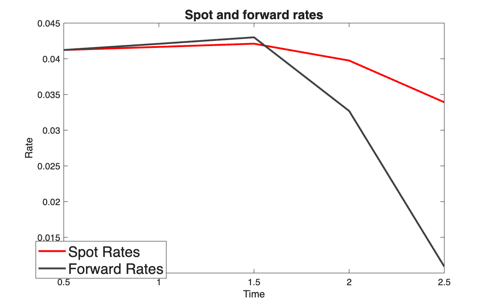

# Spot and forward rates from zero-coupon prices

<p class="ex-meta">Course exercises 55–56 · Part I</p>

## Problem

Write a function that computes forward prices and forward rates from a set of zero-coupon
prices (exercise 55). Apply it to five prices on a half-yearly schedule, compute the spot
rates and plot the two curves (exercise 56).

## Method

$$
i_{spot}(t_k) = v_k^{-1/t_k} - 1, \qquad
v_{fwd}(t_{k-1}, t_k) = \frac{v_k}{v_{k-1}}, \qquad
i_{fwd}(t_{k-1}, t_k) = v_{fwd}^{-1/(t_k - t_{k-1})} - 1
$$

The forward rate is the rate agreed today for the period between $t_{k-1}$ and $t_k$.

## Code

=== "MATLAB"

    === "S_exercise_56.m"

        ```matlab
        --8<-- "computational-finance/part-1/spot-and-forward-rates/S_exercise_56.m"
        ```

    === "F_es55.m"

        ```matlab
        --8<-- "computational-finance/part-1/spot-and-forward-rates/F_es55.m"
        ```

=== "Python"

    === "S_exercise_56.py"

        ```python
        --8<-- "computational-finance/part-1/spot-and-forward-rates/S_exercise_56.py"
        ```

    === "F_es55.py"

        ```python
        --8<-- "computational-finance/part-1/spot-and-forward-rates/F_es55.py"
        ```

## Results

| Maturity | ZCB price | Spot rate | Forward rate |
|---|---:|---:|---:|
| 0.5 | 0.980 | 4.12% | 4.12% |
| 1.0 | 0.960 | 4.17% | 4.21% |
| 1.5 | 0.940 | 4.21% | 4.30% |
| 2.0 | 0.925 | 3.98% | 3.27% |
| 2.5 | 0.920 | 3.39% | 1.09% |



## Takeaways

- The first forward rate equals the first spot rate: from today, there is no earlier period.
- When the spot curve rises the forward curve lies above it; when it falls, below. The
  forward is the marginal rate, the spot is the average.
