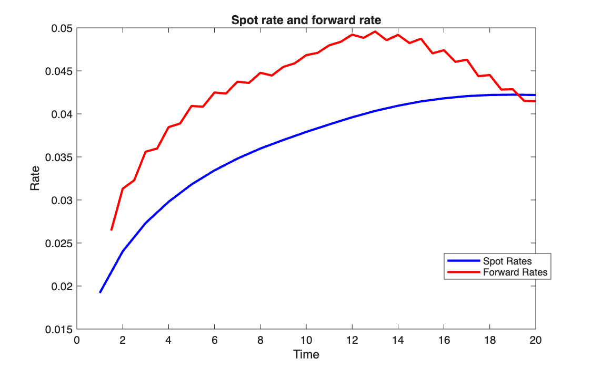
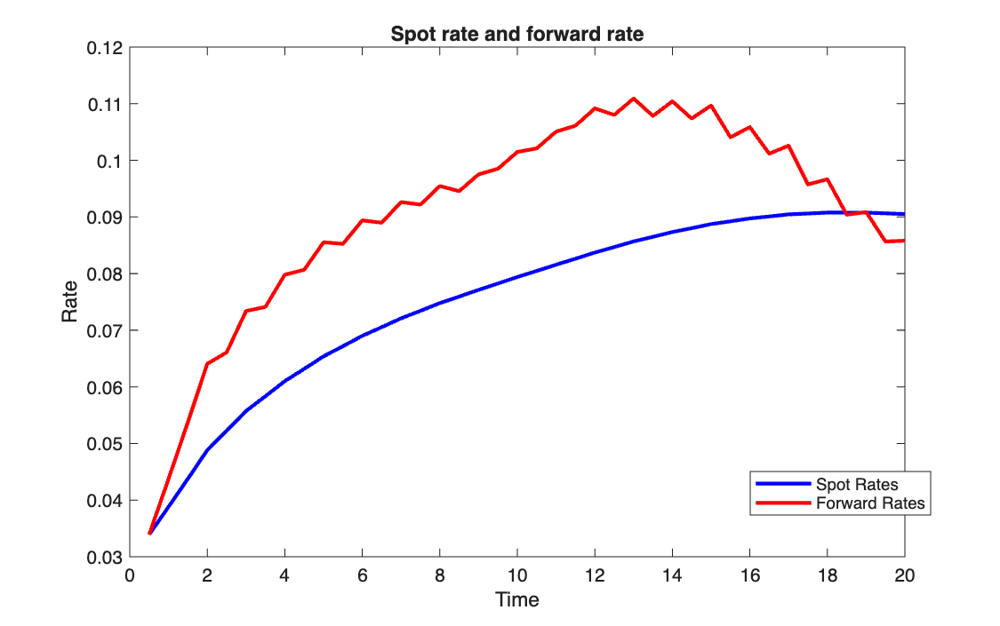

# Spot and forward curve from interest rate swaps

<p class="ex-meta">Course exercise 60 · Part I</p>

## Problem

Starting from the par rates of plain-vanilla interest rate swaps with maturities from 1 to 20
years, build the spot curve and the forward curve on a half-yearly grid. Then repeat the
exercise the wrong way on purpose, interpolating the swap rates directly, and compare.

## Method

1. **Bootstrap** the annual discount factors $v_k$ from the swap rates (as in exercise 59).
2. **Convert to continuous yields**, $y_k = -\ln(v_k)/t_k$, and interpolate the *yields*
   linearly on the half-yearly grid. Rates interpolate well; discount factors do not.
3. **Back to discount factors**, $v(t) = e^{-y(t)\,t}$, then spot and forward rates as in
   exercise 56.
4. **The wrong way:** interpolate the swap rates to the half-yearly grid and bootstrap those.

## Code

=== "MATLAB"

    === "S_exercise_60.m"

        ```matlab
        --8<-- "computational-finance/part-1/yield-curve-from-irs/S_exercise_60.m"
        ```

    === "F_es59.m"

        ```matlab
        --8<-- "computational-finance/part-1/yield-curve-from-irs/F_es59.m"
        ```

    === "F_es60.m"

        ```matlab
        --8<-- "computational-finance/part-1/yield-curve-from-irs/F_es60.m"
        ```

    === "F_es55.m"

        ```matlab
        --8<-- "computational-finance/part-1/yield-curve-from-irs/F_es55.m"
        ```

=== "Python"

    === "S_exercise_60.py"

        ```python
        --8<-- "computational-finance/part-1/yield-curve-from-irs/S_exercise_60.py"
        ```

    === "F_es55.py"

        ```python
        --8<-- "computational-finance/part-1/yield-curve-from-irs/F_es55.py"
        ```

    === "F_es59.py"

        ```python
        --8<-- "computational-finance/part-1/yield-curve-from-irs/F_es59.py"
        ```

    === "F_es60.py"

        ```python
        --8<-- "computational-finance/part-1/yield-curve-from-irs/F_es60.py"
        ```

## Results

The swap rates go from 1.92% at 1 year to 4.09% at 20 years. Through the bootstrap, the spot
curve goes from 1.92% to 4.22%, and the forward curve moves between 2.6% and 5.0%.

=== "Bootstrap, then interpolate yields"

    

=== "Interpolate swap rates, then bootstrap"

    

!!! note "What the comparison actually shows"
    The second chart is off mainly for a different reason than the one stated in the code's
    conclusion. The swap rates are interpolated to half-year steps, but `F_es59` still
    bootstraps them as annual swaps: each half-year is treated as a full year of coupon,
    which roughly **doubles** the rates (9.05% at 20 years instead of 4.22%). Bootstrapping
    the same interpolated rates with half-yearly coupons ($z/2$) gives 4.27% at 20 years,
    almost the same as the correct procedure.

    The zig-zag in the forward rates is present in **both** charts, with the same number of
    swings (23–24 changes of direction). It comes from the linear interpolation, whose slope
    changes at every original maturity, and forward rates, being marginal rates, amplify it.

    Two smaller points: the first grid point (6 months) comes before the first swap maturity
    (1 year) and is not extrapolated in the correct procedure, so that curve starts at 1 year;
    and the choice between interpolating yields and swap rates matters much less than keeping
    the coupon frequency consistent.

## Takeaways

- The order of operations is: bootstrap on the maturities that are actually quoted, then
  interpolate yields, then compute what you need on the finer grid.
- Every step must keep the same time convention: a formula written for annual coupons
  cannot be run on a half-yearly grid unchanged.
- Forward rates are the most sensitive output of a curve: any kink in the interpolation
  shows up there first.
