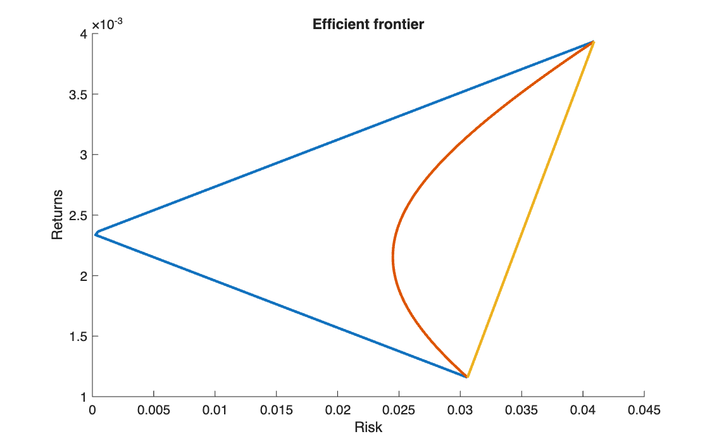

# How correlation shapes the frontier

<p class="ex-meta">Course exercise 132 · Part II</p>

## Problem

Take two stocks from the EURO STOXX 50 data and keep their own expected returns and
volatilities, but impose three correlations between them: −1, 0 and +1. Plot the three
resulting frontiers.

## Method

With two assets, the portfolio variance for weights $x_1 + x_2 = 1$ is

$$
\sigma_p^2 = x_1^2 \sigma_1^2 + x_2^2 \sigma_2^2 + 2\,x_1 x_2\,\rho\,\sigma_1 \sigma_2
$$

The covariance matrix is rebuilt for each $\rho$ and the frontier is traced with `quadprog`
over target returns between the two stocks' returns; the risk axis is the volatility
$\sigma_p$.

## Code

=== "MATLAB"

    === "S_exercise_132.m"

        ```matlab
        --8<-- "computational-finance/part-2/correlation-and-frontier/S_exercise_132.m"
        ```

=== "Python"

    === "S_exercise_132.py"

        ```python
        --8<-- "computational-finance/part-2/correlation-and-frontier/S_exercise_132.py"
        ```

## Results

The two stocks have weekly expected returns of 0.116% and 0.394% and volatilities of 3.06% and
4.09%.

| Correlation | Lowest volatility reachable |
|---|---:|
| $\rho = -1$ | 0.03% (practically zero) |
| $\rho = 0$ | 2.45% |
| $\rho = +1$ | 3.06% (the less volatile stock alone) |



## Takeaways

- With $\rho = +1$ there is no diversification: the frontier is a straight line between the
  two stocks.
- With $\rho = -1$ the two stocks hedge each other perfectly, and a riskless combination
  exists.
- Every real case lies in between: the lower the correlation, the more the curve bends to
  the left, and the more risk diversification removes.
