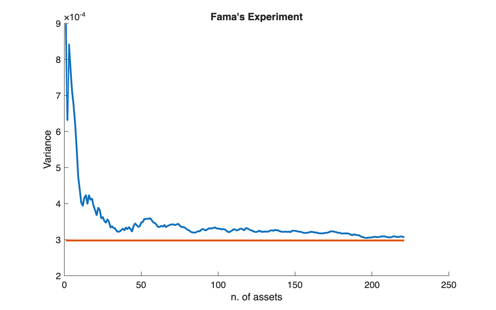

# How much risk diversification removes

<p class="ex-meta">Course exercise 134 · Part II</p>

## Problem

With weekly returns of 221 stocks of the Italian market (MIBTEL), build equally weighted
portfolios of the first $k$ stocks, for $k = 1, \dots, 221$, and plot their variance against
$k$. Compare it with the level that diversification cannot go below. This is Fama's
classic experiment.

## Method

For an equally weighted portfolio of $k$ assets, the variance splits into an average variance
term and an average covariance term:

$$
\sigma^2_{EW}(k) = \frac{1}{k}\,\bar{\sigma}^2 + \frac{k-1}{k}\,\bar{\sigma}_{ij}
\;\xrightarrow{\,k \to \infty\,}\; \bar{\sigma}_{ij}
$$

The first term vanishes as $k$ grows; the average covariance $\bar{\sigma}_{ij}$ remains. It is
computed as the sum of the off-diagonal elements of $\Sigma$ divided by their number,
$n^2 - n$.

## Code

=== "S_exercise_134.m"

    ```matlab
    --8<-- "computational-finance/part-2/diversification-fama/S_exercise_134.m"
    ```

## Results

| Number of stocks | Portfolio variance (weekly) |
|---|---:|
| 1 | 0.000898 |
| 10 | 0.000439 |
| 221 | 0.000307 |
| Average covariance (floor) | 0.000298 |



## Takeaways

- The first ten stocks remove half of the variance; the next two hundred remove little more.
- The floor is the average covariance: market risk, which no amount of diversification
  removes.
- The curve is not smooth because stocks are added in file order, not at random: each new
  stock can raise the variance as well as lower it.
