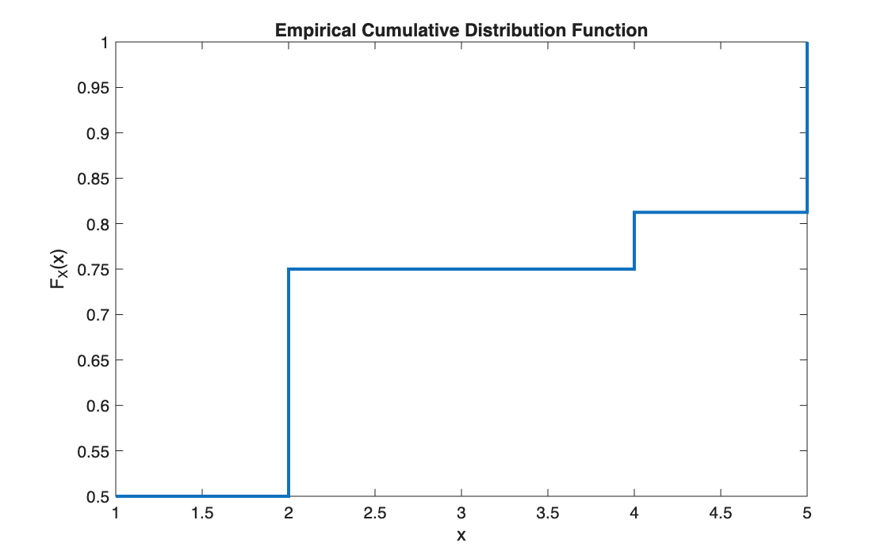
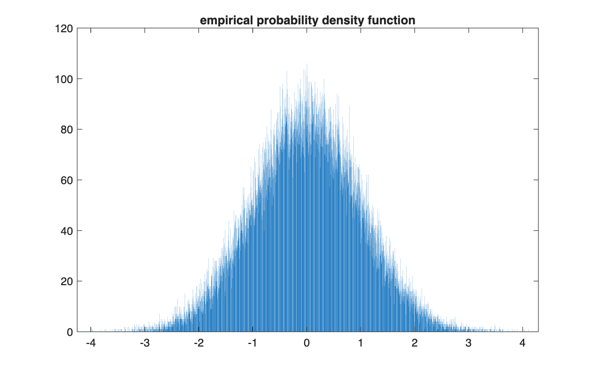

# Empirical distributions: CDF, histogram and moments

<p class="ex-meta">Course exercises 95, 99, 100 · Part II</p>

## Problem

Build the three basic tools for describing a random variable from data, each as a reusable
function: the empirical cumulative distribution function of a discrete variable (exercise 95),
the histogram of a sample as an estimate of its density (exercise 99), and the first four
moments (exercise 100). The second and third are tested on standard normal samples.

## Method

For a discrete variable with values $x_i$ and probabilities $p_i$, the CDF sums the
probabilities of the values up to $x$, so the values must be sorted first:

$$
F_X(x) = \sum_{x_i \le x} p_i
$$

The histogram splits the range $[\min y, \max y]$ into equally spaced bins and counts the
observations in each. The moments, with $\bar{x}$ the mean and $s$ the standard deviation:

$$
\bar{x} = \frac{1}{n}\sum x_i, \quad
s^2 = \frac{1}{n}\sum (x_i - \bar{x})^2, \quad
\text{skew} = \frac{1}{n}\sum \Big(\frac{x_i - \bar{x}}{s}\Big)^3, \quad
\text{kurt} = \frac{1}{n}\sum \Big(\frac{x_i - \bar{x}}{s}\Big)^4
$$

## Code

=== "S_exercise_95.m"

    ```matlab
    --8<-- "computational-finance/part-2/empirical-distributions/S_exercise_95.m"
    ```

=== "F_es95.m"

    ```matlab
    --8<-- "computational-finance/part-2/empirical-distributions/F_es95.m"
    ```

=== "S_exercise_99.m"

    ```matlab
    --8<-- "computational-finance/part-2/empirical-distributions/S_exercise_99.m"
    ```

=== "S_exercise_100.m"

    ```matlab
    --8<-- "computational-finance/part-2/empirical-distributions/S_exercise_100.m"
    ```

## Results

**CDF (exercise 95).** Values $x = (2, 4, 1, 5)$ with probabilities
$(1/4, 1/16, 1/2, 3/16)$: sorted, the CDF is 0.5, 0.75, 0.8125, 1.

=== "Empirical CDF"

    

=== "Histogram of 100,000 normal draws"

    

**Moments (exercise 100).** On one million standard normal draws:

| | Sample | Theory |
|---|---:|---:|
| Mean | 0.0009 | 0 |
| Variance | 0.9994 | 1 |
| Skewness | 0.0003 | 0 |
| Kurtosis | 3.0042 | 3 |

## Takeaways

- An empirical CDF is a step function: `stairs`, not `plot`.
- The number of bins is a choice: 4,000 bins on 100,000 draws gives about 25 observations per
  bin, enough to see the bell shape but visibly noisy.
- Kurtosis is measured against 3, the value of the normal distribution: it is the reference
  used throughout the rest of this part.
