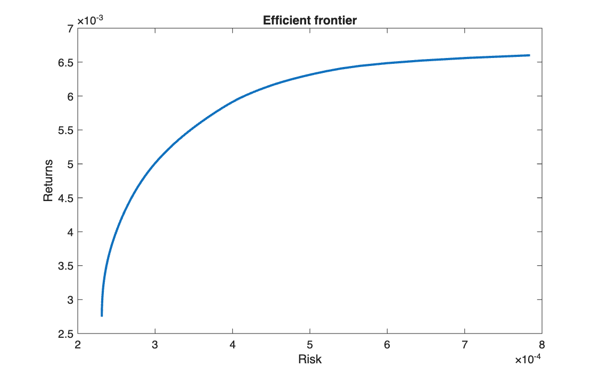

# Mean-variance efficient frontier

<p class="ex-meta">Course exercise 131 · Part II</p>

## Problem

From five years of weekly prices of the EURO STOXX 50 constituents (47 stocks, 262 weekly
returns), build the Markowitz efficient frontier with no short selling.

## Method

With expected returns $\mu$ and covariance matrix $\Sigma$ estimated from the returns, each
point of the frontier is the minimum-variance portfolio for a target return $\eta$:

$$
\min_x\ x^\top \Sigma\, x \quad \text{s.t.} \quad \mu^\top x = \eta,\quad
\mathbf{1}^\top x = 1,\quad x \ge 0
$$

The range of targets goes from the return of the global minimum-variance portfolio (solved
with the budget constraint only) to the highest single-stock return, where the only feasible
portfolio is that stock alone. `quadprog` minimises $\tfrac12 x^\top H x$, so $H = 2\Sigma$
makes its objective value exactly the portfolio variance.

## Code

=== "MATLAB"

    === "S_exercise_131.m"

        ```matlab
        --8<-- "computational-finance/part-2/markowitz-frontier/S_exercise_131.m"
        ```

=== "Python"

    === "S_exercise_131.py"

        ```python
        --8<-- "computational-finance/part-2/markowitz-frontier/S_exercise_131.py"
        ```

## Results

| | Weekly return | Weekly variance | Weekly volatility |
|---|---:|---:|---:|
| Minimum-variance portfolio | 0.275% | 0.000231 | 1.52% |
| Top of the frontier (single stock) | 0.660% | 0.000785 | 2.80% |

The minimum-variance portfolio holds 18 of the 47 stocks.



The horizontal axis is the portfolio **variance**, not the volatility.

## Takeaways

- The frontier is concave: the first units of extra return are cheap in risk, the last ones
  very expensive, because diversification is progressively given up.
- Without short selling the optimal portfolios are sparse: most stocks get zero weight even
  at the minimum-variance point.
- Everything rests on $\mu$ and $\Sigma$ estimated from 262 observations for 47 stocks; the
  frontier is only as reliable as those estimates.
