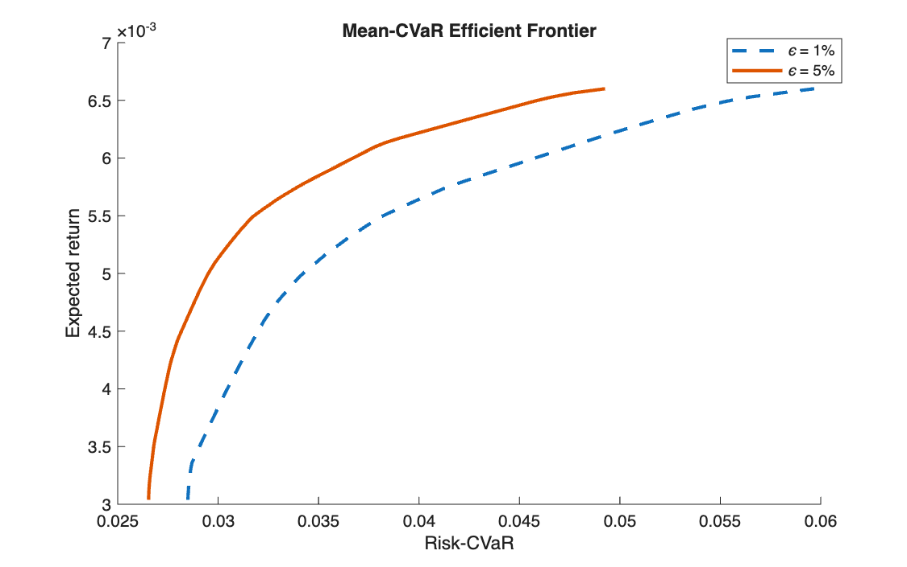

# Mean-CVaR efficient frontier

<p class="ex-meta">Course exercise 139 · Part II</p>

## Problem

On the same EURO STOXX 50 data, measure risk with the Conditional Value at Risk at 1% and at 5%,
and build the two efficient frontiers.

## Method

CVaR can be minimised as a linear program (Rockafellar–Uryasev). With a threshold variable
$\alpha$ and one excess variable $y_t \ge 0$ per scenario:

$$
\min_{x,\,y,\,\alpha}\ \alpha + \frac{1}{\varepsilon T}\sum_{t=1}^{T} y_t
\quad \text{s.t.} \quad
y_t \ge -r_t^\top x - \alpha,\quad
\mu^\top x = \eta,\quad \mathbf{1}^\top x = 1,\quad x \ge 0
$$

At the optimum $\alpha$ is the VaR and the objective is the CVaR. The same grid of target returns
is used for both levels of $\varepsilon$, so the two frontiers can be compared point by point.

## Code

=== "MATLAB"

    === "S_exercise_139.m"

        ```matlab
        --8<-- "computational-finance/part-2/mean-cvar-frontier/S_exercise_139.m"
        ```

=== "Python"

    === "S_exercise_139.py"

        ```python
        --8<-- "computational-finance/part-2/mean-cvar-frontier/S_exercise_139.py"
        ```

## Results

| | Lowest CVaR | Highest CVaR |
|---|---:|---:|
| $\varepsilon = 5\%$ | 2.65% | 4.93% |
| $\varepsilon = 1\%$ | 2.85% | 5.97% |

Weekly figures, over target returns from 0.304% to 0.660%.



## Takeaways

- CVaR is the risk measure of this part that is both coherent (it rewards diversification)
  and linear-programmable.
- The 1% frontier lies to the right of the 5% one: looking deeper into the tail sees larger
  losses for the same portfolio.
- With 262 weekly scenarios, the 1% tail is only about 3 observations, so the 1% frontier is
  close to the MaxLoss one.

## Comparing the risk measures

The four frontiers of this part use the same 47 stocks and the same 262 weeks:

| Page | Risk measure | Problem type |
|---|---|---|
| [Mean-variance](../markowitz-frontier/index.md) | variance | quadratic |
| [Mean-MAD](../mean-mad-frontier/index.md) | mean absolute deviation | linear |
| [Mean-MaxLoss](../mean-maxloss-frontier/index.md) | worst weekly loss | linear |
| Mean-CVaR | average loss in the worst ε of weeks | linear |
