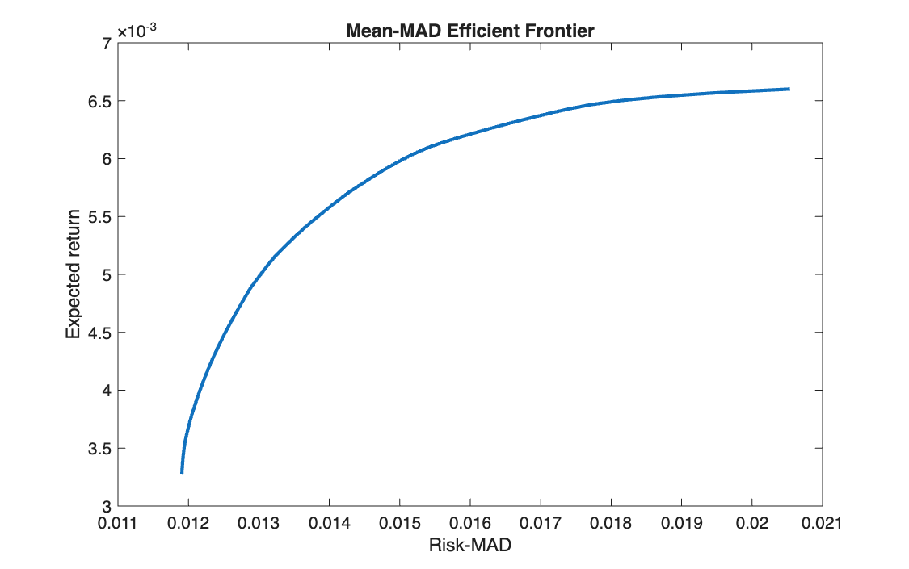

# Mean-MAD efficient frontier

<p class="ex-meta">Course exercise 135 · Part II</p>

## Problem

On the same EURO STOXX 50 data as the Markowitz frontier, replace variance with the mean
absolute deviation (MAD) as the measure of risk, and build the corresponding efficient
frontier.

## Method

The MAD of a portfolio over $T$ historical scenarios is
$\frac{1}{T}\sum_t \big| (r_t - \mu)^\top x \big|$. The absolute value is not linear, but it
becomes linear with one auxiliary variable $y_t \ge 0$ per scenario:

$$
\min_{x,\,y}\ \frac{1}{T}\sum_{t=1}^{T} y_t
\quad \text{s.t.} \quad
-y_t \le (r_t - \mu)^\top x \le y_t,\quad
\mu^\top x = \eta,\quad \mathbf{1}^\top x = 1,\quad x \ge 0
$$

At the optimum each $y_t$ equals the absolute deviation, so the whole problem is a linear
program, solved with `linprog` for 100 target returns.

## Code

=== "MATLAB"

    === "S_exercise_135.m"

        ```matlab
        --8<-- "computational-finance/part-2/mean-mad-frontier/S_exercise_135.m"
        ```

=== "Python"

    === "S_exercise_135.py"

        ```python
        --8<-- "computational-finance/part-2/mean-mad-frontier/S_exercise_135.py"
        ```

## Results

The minimum-MAD portfolio has a weekly MAD of 1.19% and an expected return of 0.328%, holding
13 stocks. At the top of the frontier the MAD is 2.05%.



## Takeaways

- Replacing variance with MAD turns a quadratic program into a linear one, at the cost of $T$
  extra variables and $2T$ constraints.
- MAD does not need a covariance matrix: it works directly on the historical scenarios.
- It penalises deviations linearly rather than quadratically, so it is less driven by a few
  extreme weeks than variance is.
