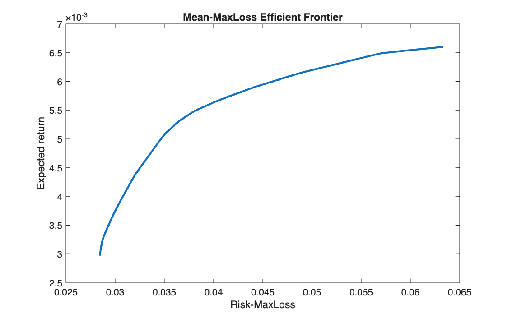

# Mean-MaxLoss efficient frontier

<p class="ex-meta">Course exercise 136 · Part II</p>

## Problem

On the same EURO STOXX 50 data, measure risk as the worst weekly return observed in the
sample, and build the frontier that minimises that worst loss for each target return.

## Method

Maximising the worst portfolio return is linear with one auxiliary variable $d$, a lower bound
on the portfolio return in every scenario:

$$
\max_{x,\,d}\ d
\quad \text{s.t.} \quad
d \le r_t^\top x \ \ \forall t,\quad
\mu^\top x = \eta,\quad \mathbf{1}^\top x = 1,\quad x \ge 0
$$

At the optimum $d$ is the worst return, and $-d$ is the maximum loss. `linprog` minimises, so
the objective is $-d$.

## Code

=== "MATLAB"

    === "S_exercise_136.m"

        ```matlab
        --8<-- "computational-finance/part-2/mean-maxloss-frontier/S_exercise_136.m"
        ```

=== "Python"

    === "S_exercise_136.py"

        ```python
        --8<-- "computational-finance/part-2/mean-maxloss-frontier/S_exercise_136.py"
        ```

## Results

The minimum-MaxLoss portfolio loses at most 2.85% in its worst week, with an expected return of
0.297%, holding 10 stocks. At the top of the frontier the worst week costs 6.33%.



## Takeaways

- The worst case of the sample becomes an explicit constraint: only one variable is added,
  and one constraint per week.
- It is the most conservative measure of the set: it looks at a single observation, the
  worst, and ignores how often bad weeks happen.
- That same feature makes it unstable: one extreme week in or out of the sample can move the
  whole frontier.
