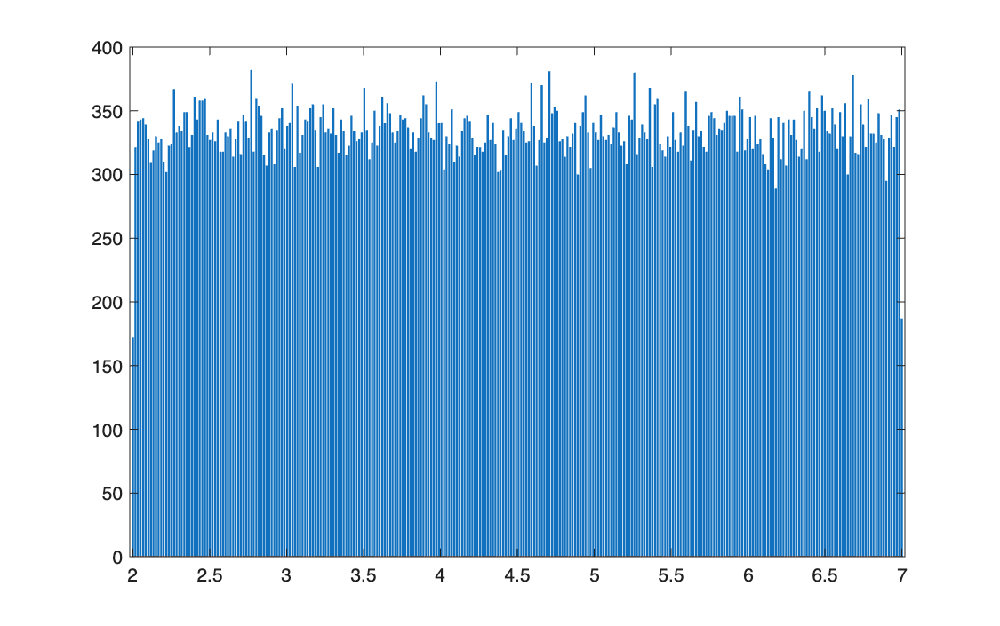
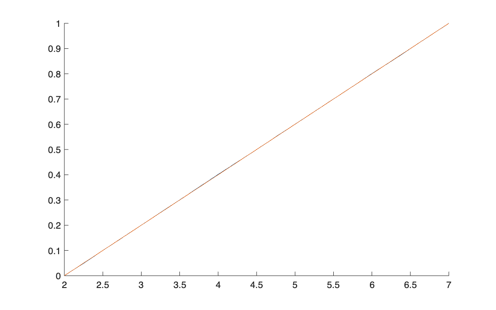
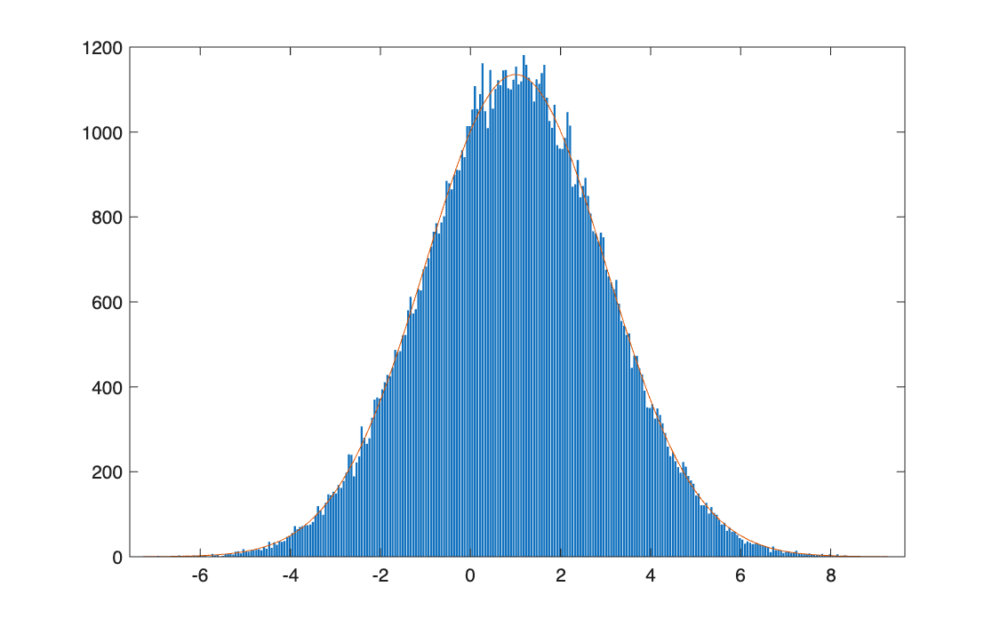
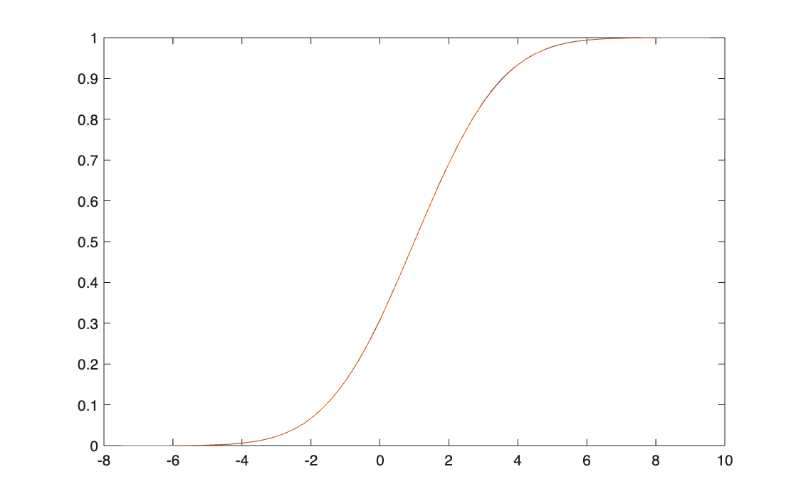
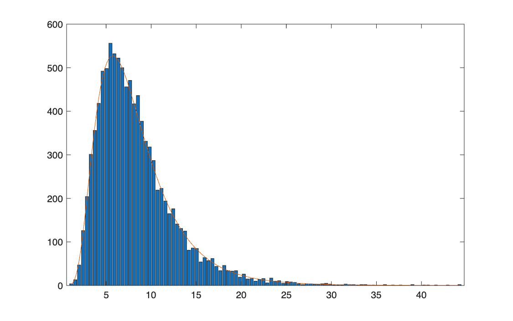
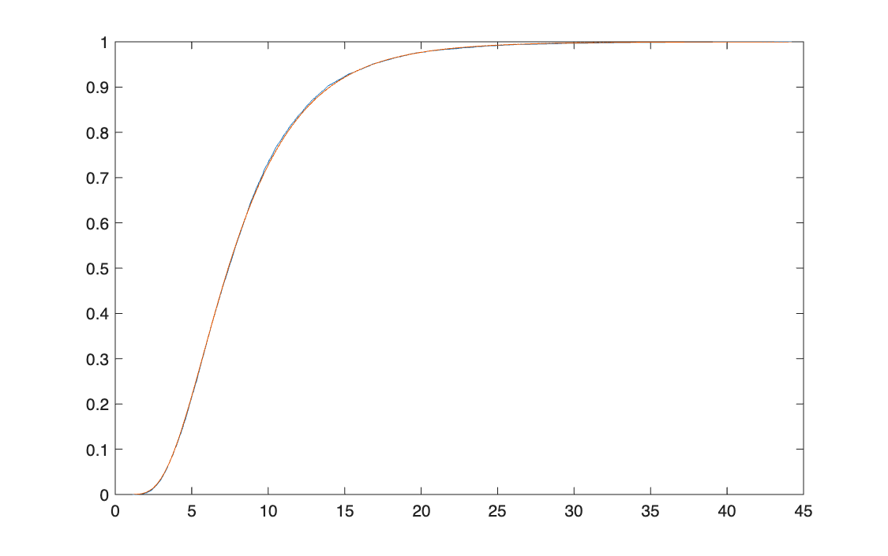
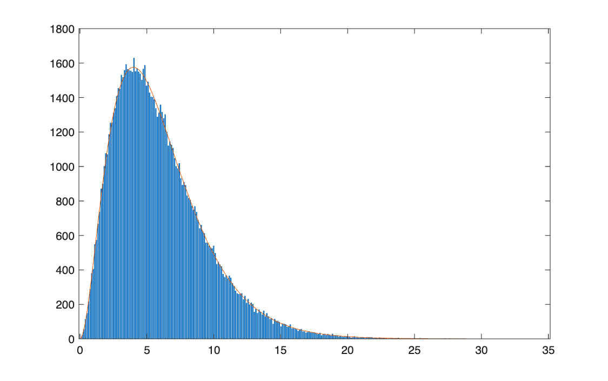
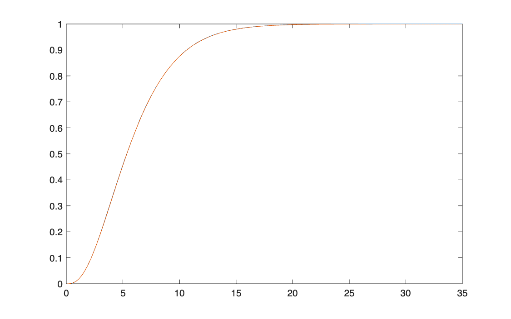
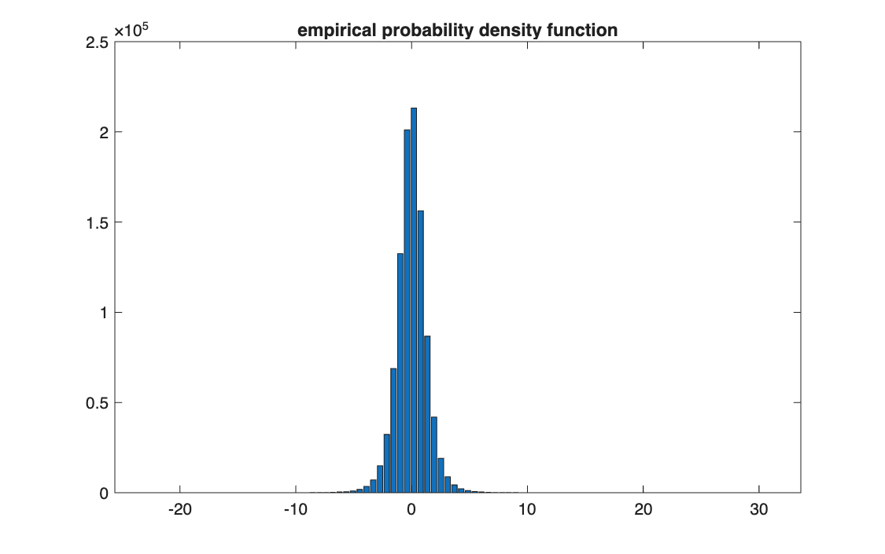
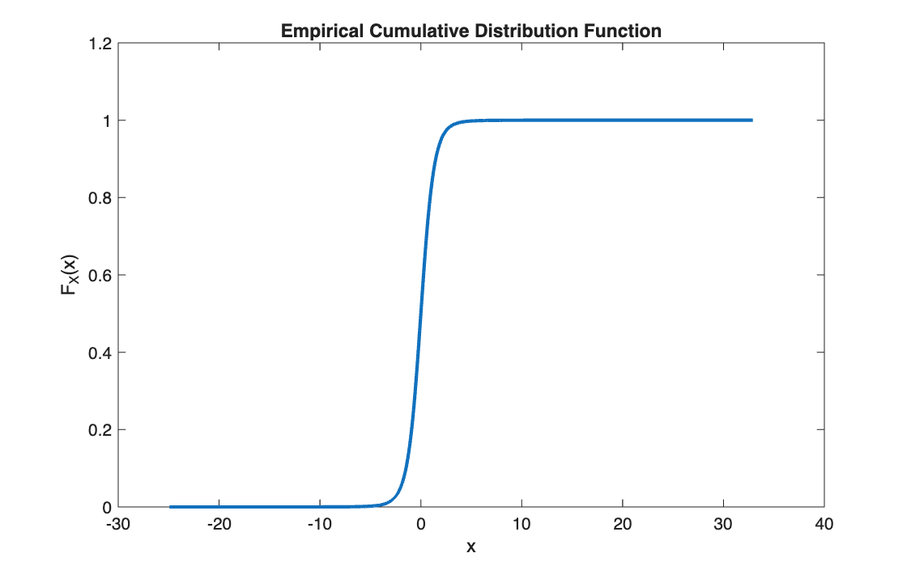

# Simulating random variables

<p class="ex-meta">Course exercises 103, 107, 108, 109, 110 · Part II</p>

## Problem

Generate large samples from five distributions, each built from uniform or standard normal
draws: uniform, normal, log-normal, chi-square and Student's t. For each, plot the empirical
density and CDF against the theoretical ones and compare the sample moments with their
theoretical values.

## Method

Every distribution is obtained by transforming simple draws, $Z \sim U[0,1]$ or
$Z \sim \mathcal{N}(0,1)$:

| Distribution | Construction | Exercise |
|---|---|---|
| Uniform $U[a,b]$ | $a + (b - a)\,Z$, with $Z \sim U[0,1]$ | 103 |
| Normal $\mathcal{N}(\mu, \sigma^2)$ | $\mu + \sigma Z$ | 107 |
| Log-normal | $e^{\mu + \sigma Z}$ | 108 |
| Chi-square, $\nu$ d.o.f. | $\sum_{j=1}^{\nu} Z_j^2$ | 109 |
| Student's t, $\nu$ d.o.f. | $Z_0 \,/\, \sqrt{\tfrac{1}{\nu}\sum_{j=1}^{\nu} Z_j^2}$ | 110 |

To overlay a theoretical density on a histogram of counts, the density is scaled by
$n \times$ bin width.

## Code

=== "S_exercise_103.m"

    ```matlab
    --8<-- "computational-finance/part-2/simulating-distributions/S_exercise_103.m"
    ```

=== "S_exercise_107.m"

    ```matlab
    --8<-- "computational-finance/part-2/simulating-distributions/S_exercise_107.m"
    ```

=== "S_exercise_108.m"

    ```matlab
    --8<-- "computational-finance/part-2/simulating-distributions/S_exercise_108.m"
    ```

=== "S_exercise_109.m"

    ```matlab
    --8<-- "computational-finance/part-2/simulating-distributions/S_exercise_109.m"
    ```

=== "S_exercise_110.m"

    ```matlab
    --8<-- "computational-finance/part-2/simulating-distributions/S_exercise_110.m"
    ```

=== "Functions"

    ```matlab
    --8<-- "computational-finance/part-2/simulating-distributions/F_Empirical_pdf.m"
    ```

    ```matlab
    --8<-- "computational-finance/part-2/simulating-distributions/F_Empirical_cdf.m"
    ```

    ```matlab
    --8<-- "computational-finance/part-2/simulating-distributions/F_SynteticIndices.m"
    ```

    Exercise 110 uses `F_es99`, `F_es95` and `F_es100` from
    [the previous page](../empirical-distributions/index.md).

## Results

Sample moments against theory (100,000 draws; one million for the Student's t):

| Distribution | Parameters | Mean | Variance | Skewness | Kurtosis |
|---|---|---|---|---|---|
| Uniform | $a = 2,\ b = 7$ | 4.499 (4.5) | 2.084 (2.083) | 0.003 (0) | 1.799 (1.8) |
| Normal | $\mu = 1,\ \sigma = 2$ | 0.998 (1) | 3.975 (4) | 0.004 (0) | 2.989 (3) |
| Log-normal | $\mu = 2,\ \sigma = 0.5$ | 8.369 (8.373) | 20.02 (19.91) | 1.826 (1.750) | 8.99 (8.90) |
| Chi-square | $\nu = 6$ | 5.991 (6) | 11.96 (12) | 1.153 (1.155) | 5.005 (5) |
| Student's t | $\nu = 5$ | 0.001 (0) | 1.665 (1.667) | 0.036 (0) | 8.76 (9) |

Theoretical values in brackets. The log-normal sample has 10,000 draws.

=== "Uniform"

    
    

=== "Normal"

    
    

=== "Log-normal"

    
    

=== "Chi-square"

    
    

=== "Student's t"

    
    

!!! note "Two things to read correctly in the charts"
    In the uniform histogram (exercise 103) the theoretical density is plotted without the
    $n \times$ bin width scaling used in exercises 107–109, so it sits at 0.2, flat on the
    horizontal axis, while the bars are around 330.

    In every histogram built this way, the first and last bars are about half as tall as
    their neighbours: the bins are centred on the minimum and the maximum of the sample, so
    those two bins cover only half a bin width. It is most visible on the uniform.

## Takeaways

- Every distribution in the list can be simulated from normal or uniform draws alone; this is
  how the Monte Carlo methods in Part III generate their scenarios.
- Heavier tails converge more slowly: the Student's t with 5 degrees of freedom still misses
  its theoretical kurtosis (8.76 against 9) with a million draws, because its fourth moment
  depends on rare, extreme observations.
- As $\sigma$ shrinks, the log-normal's skewness goes to 0 and its kurtosis to 3: it
  approaches a normal.
