# Are prices or returns stationary? Four Dow Jones stocks, 2006–2026

<p class="ex-meta">Course exercise 119 · Part II</p>

## Problem

Take twenty years of daily prices for four Dow Jones stocks (Apple, JPMorgan, Chevron,
Johnson & Johnson), compute their returns and descriptive statistics, and test empirically
whether prices and returns are stationary, by splitting the history in two and comparing the
distributions of the two halves.

## Method

A process is stationary if its probability distribution does not change over time. An
empirical check: split the sample into **Period 1** (January 2006 – December 2015, 2,513 days)
and **Period 2** (January 2016 – April 2026, 2,576 days), then compare the histograms and the
first four moments of each period, first for prices, then for linear returns.

## Code

=== "MATLAB"

    === "S_exercise_119.m"

        ```matlab
        --8<-- "computational-finance/part-2/stationarity-of-returns/S_exercise_119.m"
        ```

    === "F_es99.m"

        ```matlab
        --8<-- "computational-finance/part-2/stationarity-of-returns/F_es99.m"
        ```

    === "F_es100.m"

        ```matlab
        --8<-- "computational-finance/part-2/stationarity-of-returns/F_es100.m"
        ```

=== "Python"

    === "S_exercise_119.py"

        ```python
        --8<-- "computational-finance/part-2/stationarity-of-returns/S_exercise_119.py"
        ```

    === "F_es100.py"

        ```python
        --8<-- "computational-finance/part-2/stationarity-of-returns/F_es100.py"
        ```

    === "F_es99.py"

        ```python
        --8<-- "computational-finance/part-2/stationarity-of-returns/F_es99.py"
        ```

## Results

### Full sample: daily returns

| | AAPL | JPM | CVX | JNJ |
|---|---:|---:|---:|---:|
| Mean | 0.110% | 0.066% | 0.040% | 0.033% |
| Standard deviation | 1.99% | 2.31% | 1.80% | 1.10% |
| Skewness | 0.02 | 0.92 | 0.08 | 0.15 |
| Kurtosis | 9.1 | 22.0 | 23.4 | 14.3 |

Correlations range from 0.31 (AAPL–JNJ) to 0.51 (JPM–CVX).

=== "AAPL"

    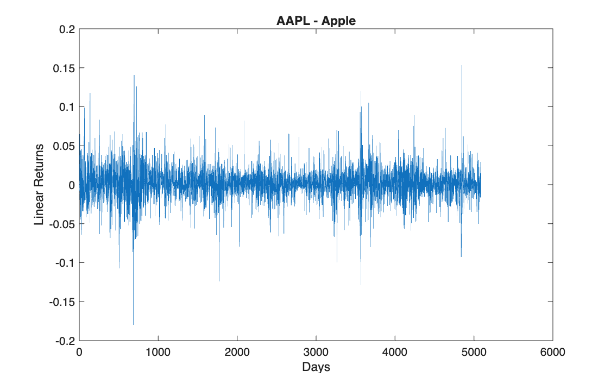

=== "JPM"

    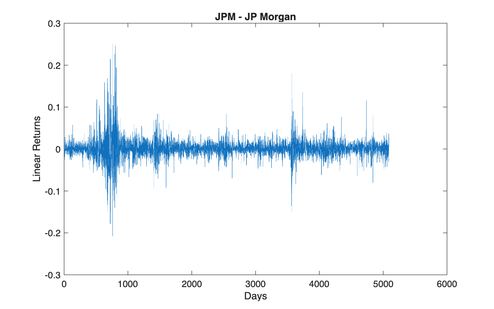

=== "CVX"

    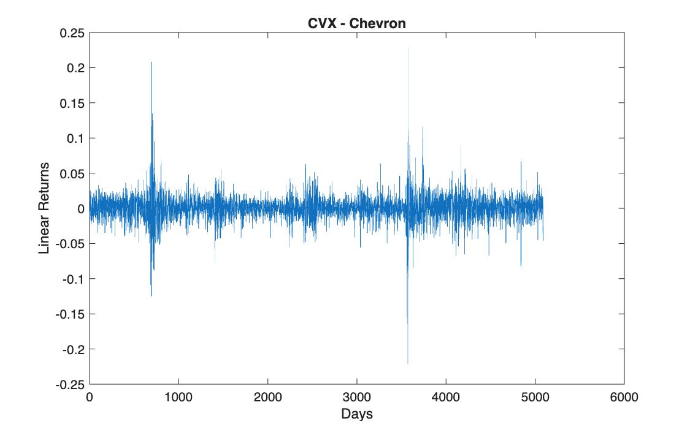

=== "JNJ"

    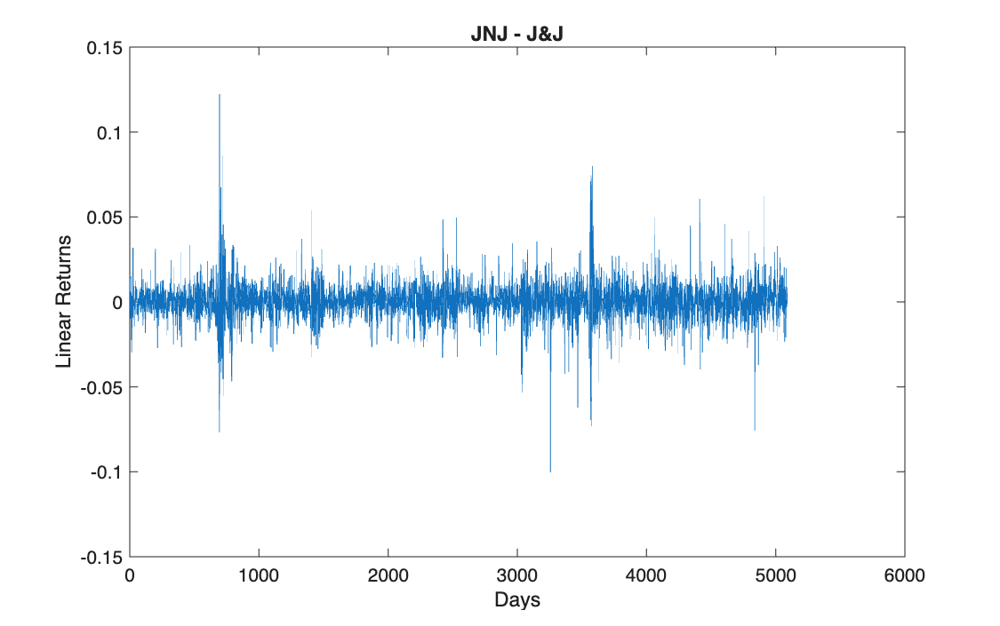

### Prices: Period 1 against Period 2

| | Mean | Variance | Skewness | Kurtosis |
|---|---|---|---|---|
| AAPL | 13.04 → 119.98 | 81 → 5,675 | 0.57 → 0.29 | 2.12 → 1.80 |
| JPM | 45.99 → 143.99 | 97 → 4,216 | 0.29 → 1.19 | 2.81 → 3.67 |
| CVX | 92.45 → 127.98 | 406 → 794 | 0.06 → 0.18 | 1.84 → 2.17 |
| JNJ | 72.81 → 150.13 | 255 → 591 | 0.95 → 0.85 | 2.37 → 5.13 |

=== "AAPL"

    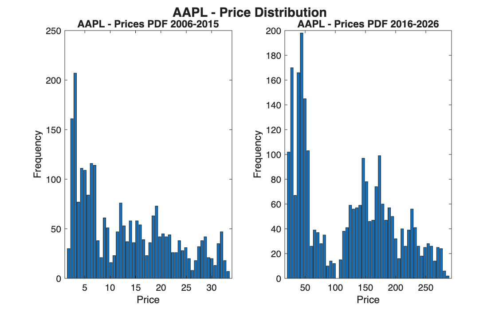

=== "JPM"

    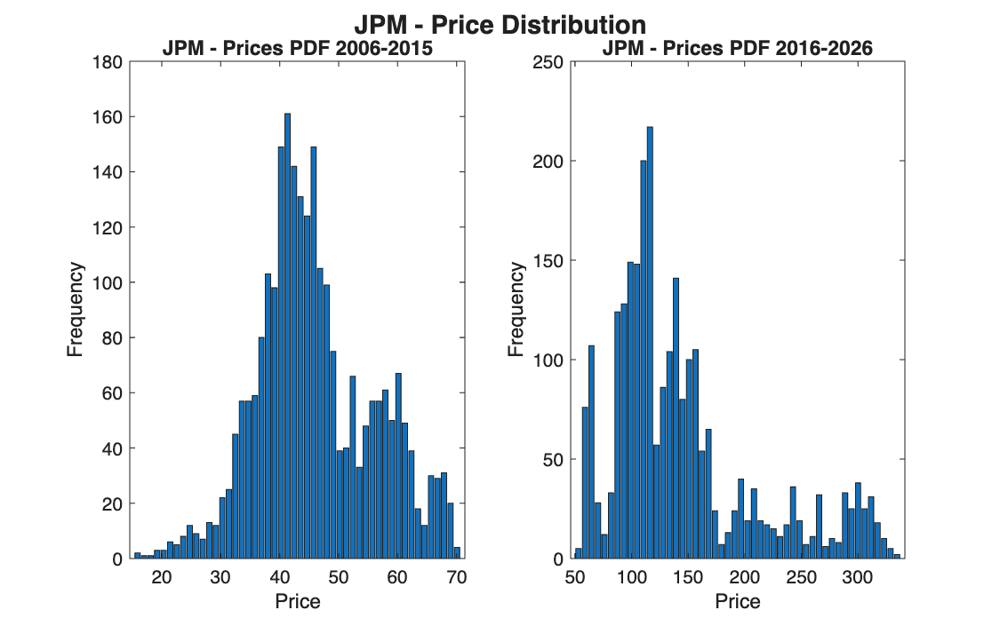

=== "CVX"

    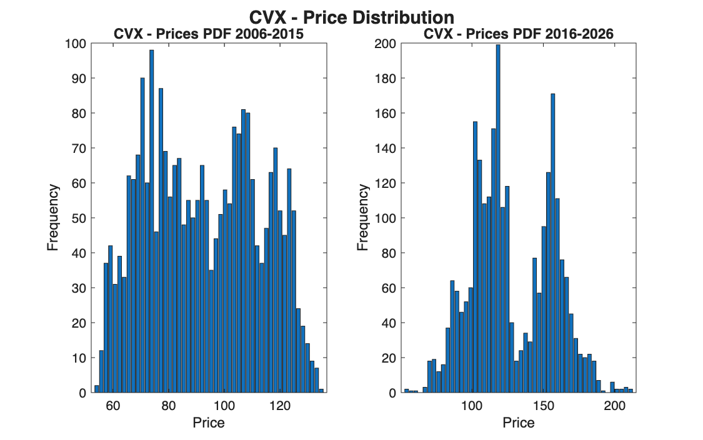

=== "JNJ"

    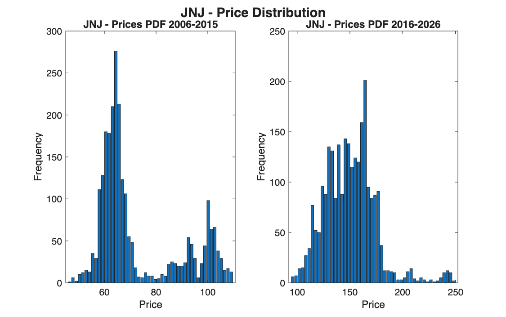

### Returns: Period 1 against Period 2

Mean and variance in units of $10^{-4}$.

| | Mean | Variance | Skewness | Kurtosis |
|---|---|---|---|---|
| AAPL | 11.43 → 10.49 | 4.62 → 3.33 | −0.07 → 0.15 | 8.33 → 9.86 |
| JPM | 5.77 → 7.33 | 7.68 → 3.02 | 1.00 → 0.32 | 18.82 → 16.46 |
| CVX | 3.19 → 4.77 | 3.05 → 3.41 | 0.54 → −0.31 | 18.53 → 27.03 |
| JNJ | 2.56 → 4.03 | 1.06 → 1.34 | 0.68 → −0.22 | 16.85 → 12.45 |

=== "AAPL"

    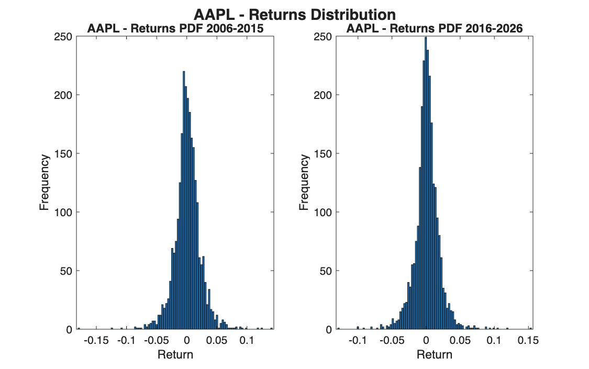

=== "JPM"

    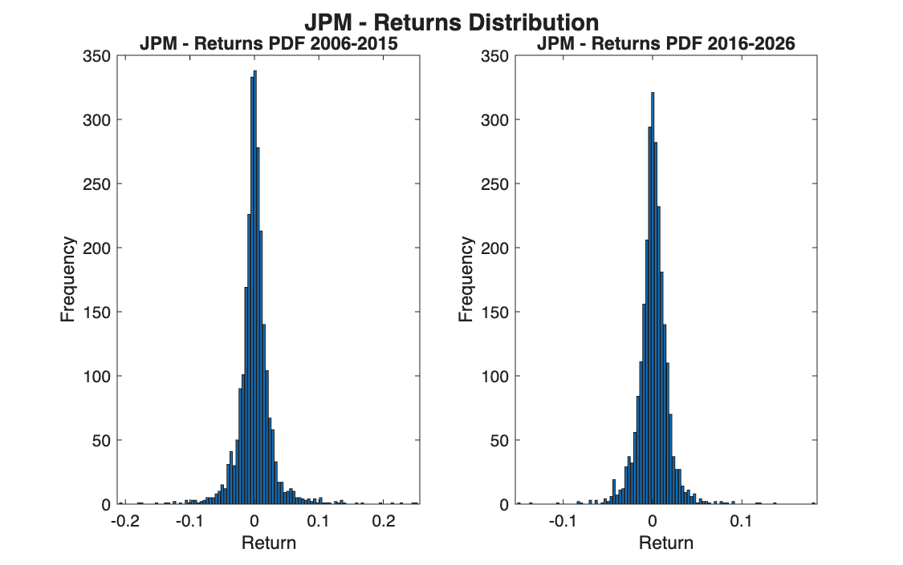

=== "CVX"

    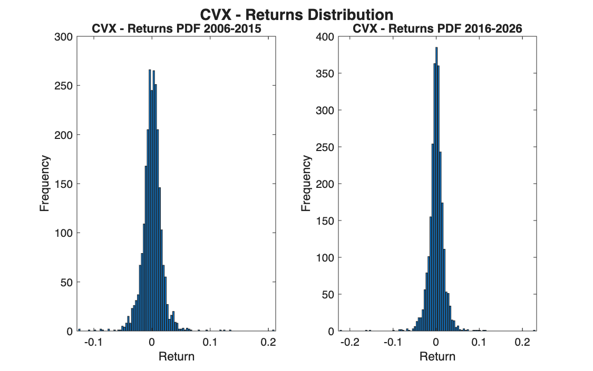

=== "JNJ"

    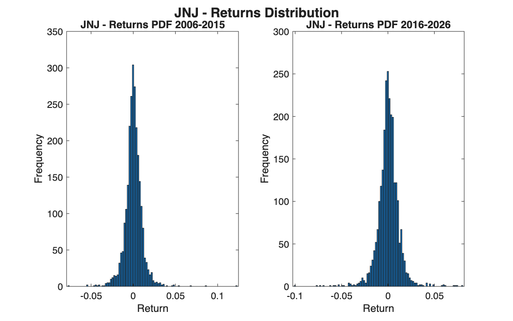

!!! note "Two corrections to the comments in the code"
    The results table written in the code's comments matches the computation in every cell
    but one: the mean daily return of AAPL is 11.43 and 10.49 ($\times 10^{-4}$), not 10.11
    and 9.74. The conclusion does not change.

    In Point 3, the comment says the second argument of `std`, `skewness` and `kurtosis` is
    the dimension, as for `mean(Returns, 1)`. For those three functions it is a
    normalisation flag instead: `std(Returns, 1)` divides by $N$ rather than $N - 1$. The
    statistics are still computed column by column, and with 5,000 observations the
    difference is invisible, but the reason in the comment is not the right one.

## Takeaways

- **Prices are not stationary.** Their mean, variance and shape change completely between
  the two periods: AAPL's average price rises nine-fold and its variance seventy-fold.
- **Returns are approximately stationary.** Same centre, same order of magnitude of
  variance, similar shape in both periods. This is why models are built on returns.
- **Fat tails are the stable feature.** Kurtosis is far above 3 in both periods for every
  stock: extreme days happen much more often than a normal distribution predicts, and they
  keep happening.
