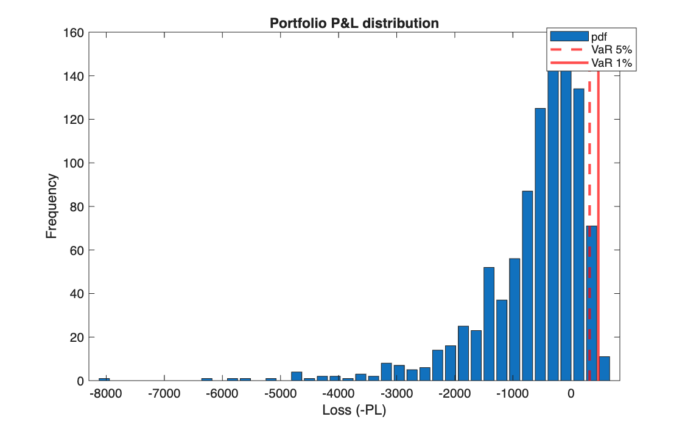
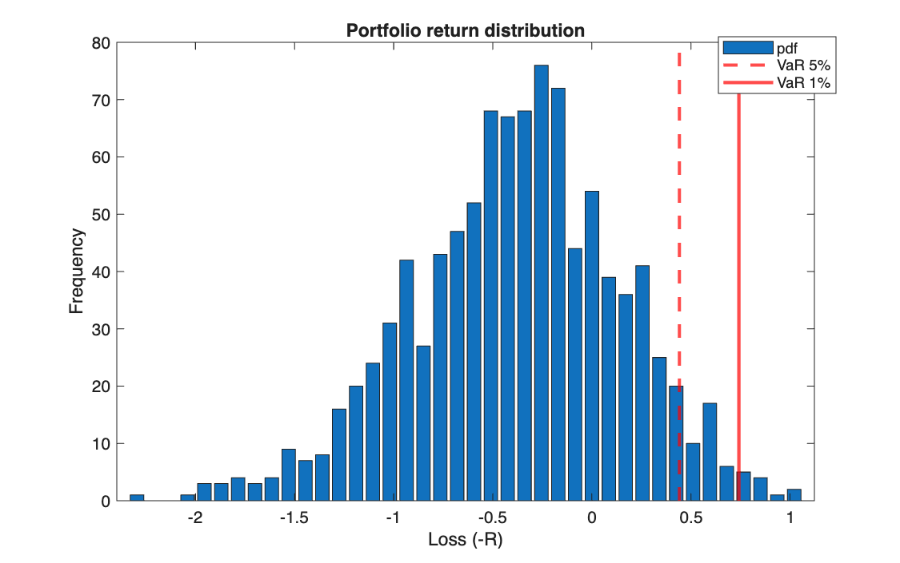

# Value at Risk and Conditional VaR by simulation

<p class="ex-meta">Course exercises 137–138 · Part II</p>

## Problem

A portfolio of five stocks is worth 900 today. Simulate 1,000 scenarios of log-normal prices
at the horizon, compute the profit and loss distribution, and estimate its Value at Risk at
5% and 1% (exercise 137) and its Conditional Value at Risk at 5% (exercise 138).

## Method

Prices at the horizon are $P_T = P_0\, e^{R}$ with $R \sim \mathcal{N}(0, 1)$ for each stock,
and $PL = V_T - V_0$. With the $m$ simulated P&L values sorted from the worst:

$$
\text{VaR}_\varepsilon = -PL_{(k)}, \qquad
\text{CVaR}_\varepsilon = -\frac{1}{k}\sum_{i=1}^{k} PL_{(i)}, \qquad k \approx \varepsilon\, m
$$

VaR is the loss exceeded only in the worst $\varepsilon$ of scenarios; CVaR is the average loss
in those scenarios.

## Code

=== "S_exercise_137.m"

    ```matlab
    --8<-- "computational-finance/part-2/var-and-cvar/S_exercise_137.m"
    ```

=== "S_exercise_138.m"

    ```matlab
    --8<-- "computational-finance/part-2/var-and-cvar/S_exercise_138.m"
    ```

=== "F_Empirical_pdf.m"

    ```matlab
    --8<-- "computational-finance/part-2/var-and-cvar/F_Empirical_pdf.m"
    ```

## Results

Both scripts draw the same 1,000 scenarios (random seed 0 when generating this page).

| | 5% | 1% |
|---|---:|---:|
| VaR on P&L (exercise 137) | 321.34 | 471.58 |
| VaR on log return (exercise 137) | 0.442 | 0.742 |
| VaR on P&L (exercise 138) | 322.88 | |
| CVaR on P&L (exercise 138) | 415.71 | |

=== "P&L"

    

=== "Return"

    

## Takeaways

- On the same scenarios, the two scripts give two different 5% VaRs (321.34 and 322.88)
  because they pick different order statistics: the 51st worst loss
  (`floor(0.05*m) + 1`) against the 50th (`round(0.05*m)`). With a finite sample, the
  quantile convention is part of the definition.
- CVaR is always at least as large as VaR, because it averages the losses beyond it: here
  415.71 against 322.88.
- With log-normal prices the loss is capped at the portfolio value (900), while gains are
  unbounded: the distribution is strongly asymmetric, which is why a normal approximation of
  the P&L would be poor.
