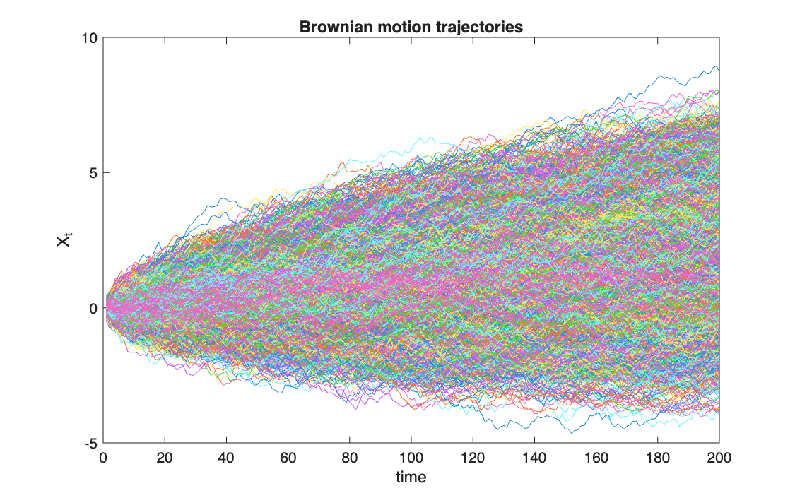
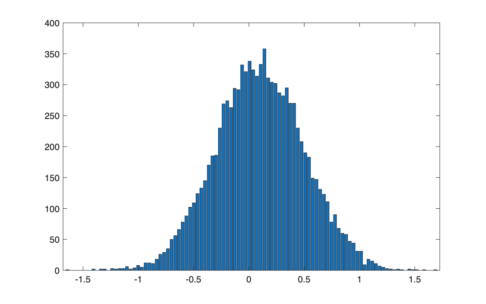
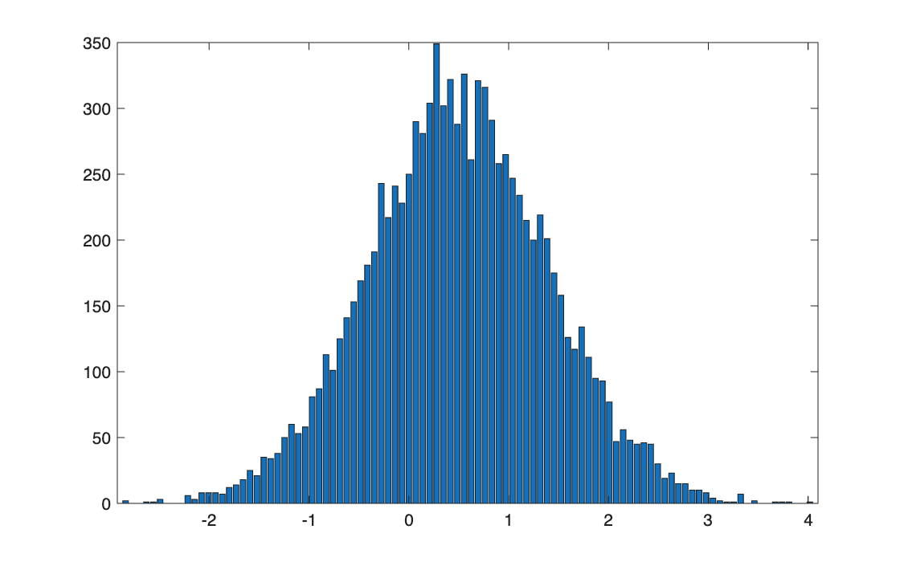
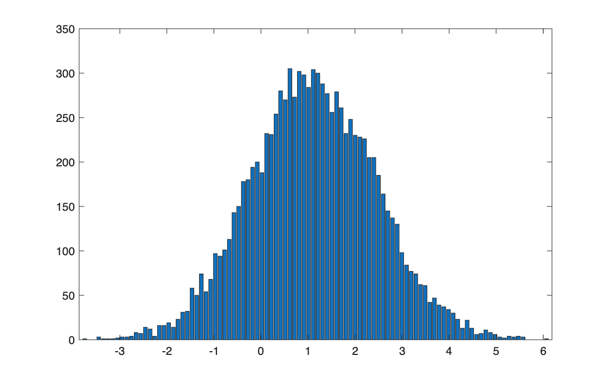
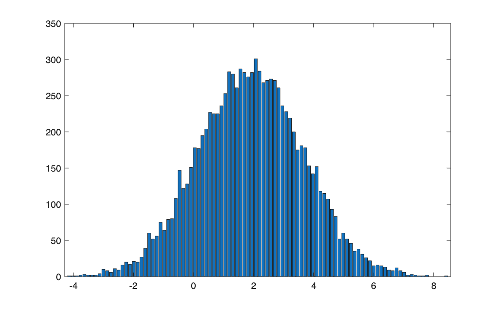

# Simulating Brownian motion

<p class="ex-meta">Course exercise 154 · Part III</p>

## Problem

Simulate 10,000 paths of a Brownian motion with drift, over 200 steps, and study how the
distribution of the process across paths changes over time.

## Method

With drift $\mu$ and diffusion $\sigma$, each step adds a normal increment:

$$
X_{k} = X_{k-1} + \mu\,\Delta t + \sigma\sqrt{\Delta t}\;Z_k, \qquad Z_k \sim \mathcal{N}(0,1)
$$

so that $X_t \sim \mathcal{N}(X_0 + \mu t,\ \sigma^2 t)$. All increments are generated at once as an
$n \times m$ matrix, and `cumsum` along each row builds the paths. Here $\mu = 0.1$,
$\sigma = 0.4$, $\Delta t = 0.1$, $X_0 = 0$.

## Code

=== "S_exercise_154.m"

    ```matlab
    --8<-- "computational-finance/part-3/brownian-motion/S_exercise_154.m"
    ```

## Results

| Step $k$ | Time $t$ | Mean (theory) | Standard deviation (theory) |
|---|---:|---:|---:|
| 10 | 1 | 0.099 (0.100) | 0.399 (0.400) |
| 50 | 5 | 0.501 (0.500) | 0.900 (0.894) |
| 110 | 11 | 1.115 (1.100) | 1.332 (1.327) |
| 190 | 19 | 1.912 (1.900) | 1.748 (1.744) |



=== "k = 10"

    

=== "k = 50"

    

=== "k = 110"

    

=== "k = 190"

    

## Takeaways

- The distribution stays normal at every time; it drifts at speed $\mu$ and widens as
  $\sqrt{t}$, not as $t$.
- The drift is small compared with the noise: after 19 time units the mean is 1.9 but the
  standard deviation is 1.7, so many paths still end below zero.
- Generating the whole increment matrix and cumulating it is the vectorised form of the loop
  over time steps.
