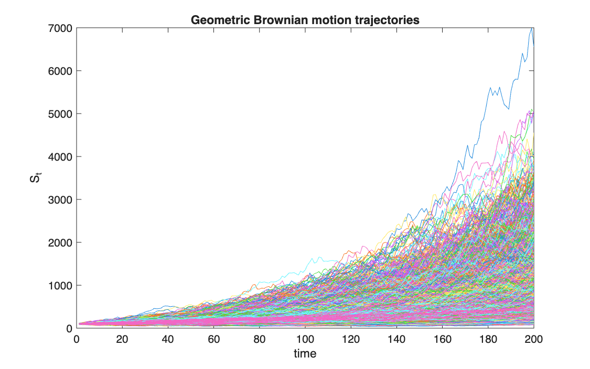
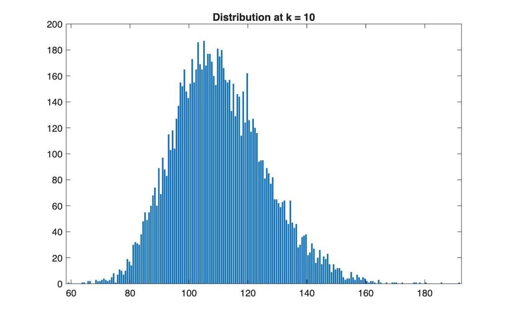
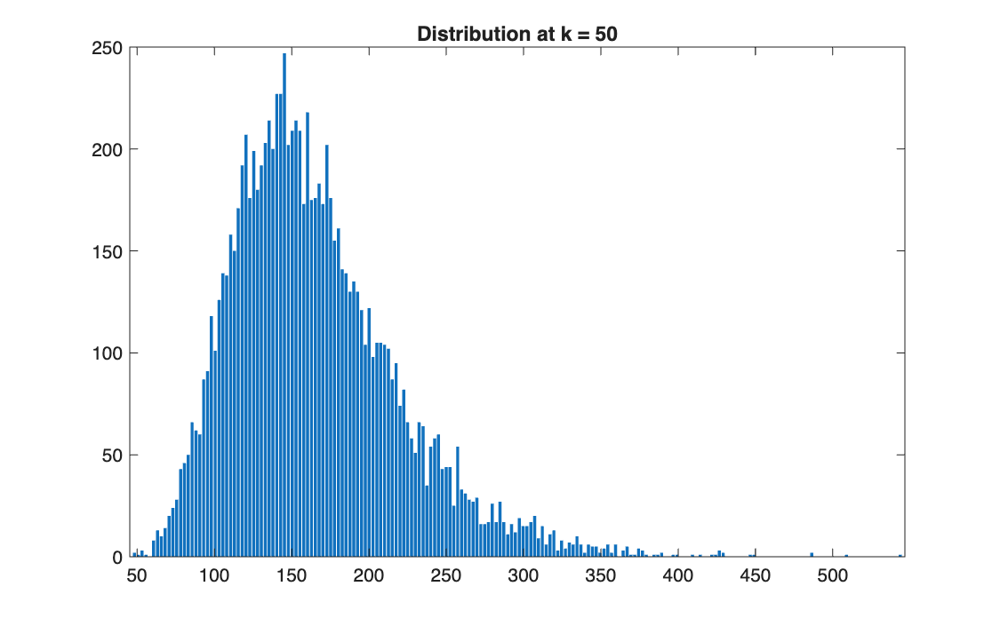
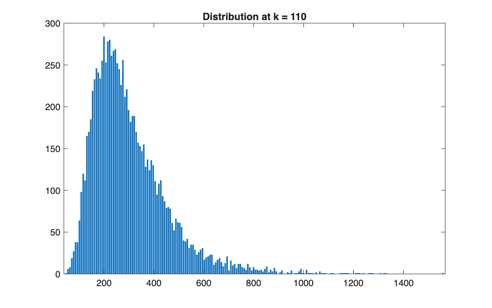
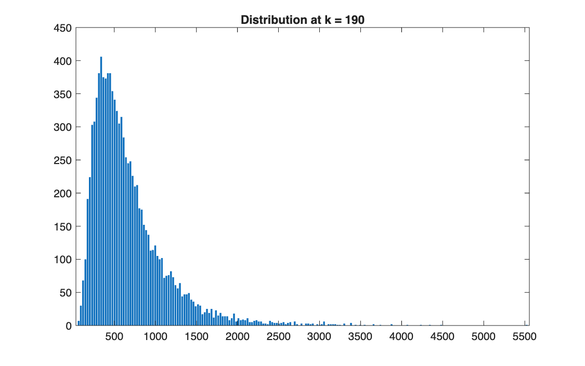

# Simulating geometric Brownian motion

<p class="ex-meta">Course exercise 162 · Part III</p>

## Problem

Simulate 10,000 price paths following a geometric Brownian motion, the model behind
Black–Scholes, over 200 steps, and study the distribution of the price across paths over time.

## Method

The logarithm of the price follows a Brownian motion, so the price itself is:

$$
S_{t} = S_0 \exp\!\Big(\big(\mu - \tfrac12\sigma^2\big)t + \sigma W_t\Big)
$$

simulated by cumulating the increments of $\ln S$,
$(\mu - \tfrac12\sigma^2)\Delta t + \sigma\sqrt{\Delta t}\,Z$. Then $S_t$ is log-normal, with
$\mathbb{E}[S_t] = S_0 e^{\mu t}$ and median $S_0 e^{(\mu - \sigma^2/2)t}$. Here $S_0 = 100$,
$\mu = 0.2$, $\sigma = 0.2$, $\Delta t = 0.05$.

## Code

=== "MATLAB"

    === "S_exercise_162.m"

        ```matlab
        --8<-- "computational-finance/part-3/geometric-brownian-motion/S_exercise_162.m"
        ```

=== "Python"

    === "S_exercise_162.py"

        ```python
        --8<-- "computational-finance/part-3/geometric-brownian-motion/S_exercise_162.py"
        ```

    === "F_Empirical_pdf.py"

        ```python
        --8<-- "computational-finance/part-3/geometric-brownian-motion/F_Empirical_pdf.py"
        ```


In MATLAB, the helper `F_Empirical_pdf` is the one shown in [Part II](../../part-2/simulating-distributions/index.md).

## Results

| Step $k$ | Time $t$ | Mean (theory) | Median (theory) | Skewness |
|---|---:|---:|---:|---:|
| 10 | 0.5 | 110.5 (110.5) | 109.3 (109.4) | 0.42 |
| 50 | 2.5 | 165.0 (164.9) | 156.1 (156.8) | 1.04 |
| 110 | 5.5 | 302.5 (300.4) | 269.1 (269.1) | 1.66 |
| 190 | 9.5 | 672.4 (668.6) | 555.1 (552.9) | 2.21 |



=== "k = 10"

    

=== "k = 50"

    

=== "k = 110"

    

=== "k = 190"

    

## Takeaways

- Prices stay positive and their distribution becomes more and more right-skewed: a few paths
  go very high (close to 7,000 from 100), most stay much lower.
- The mean grows at $\mu$, but the median grows only at $\mu - \sigma^2/2$: the typical path is
  below the average one, and the gap widens over time.
- This is the same log-normal of Part II, now evolving in time; it is what the Monte Carlo
  pricers on the next pages simulate.
