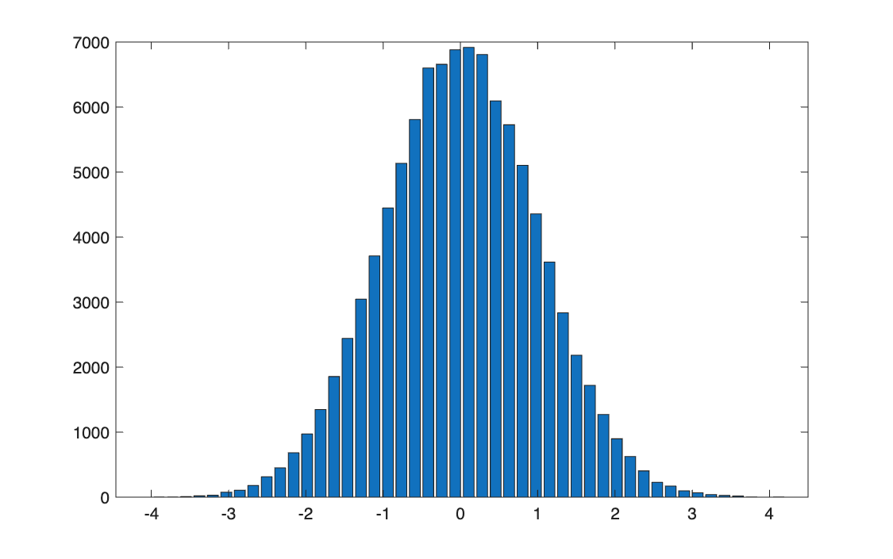
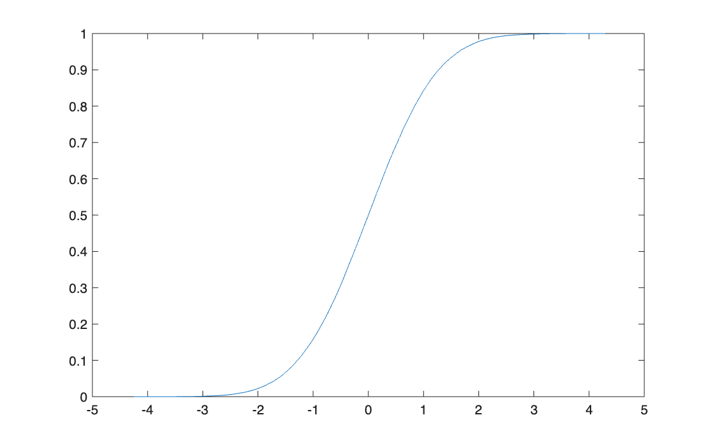
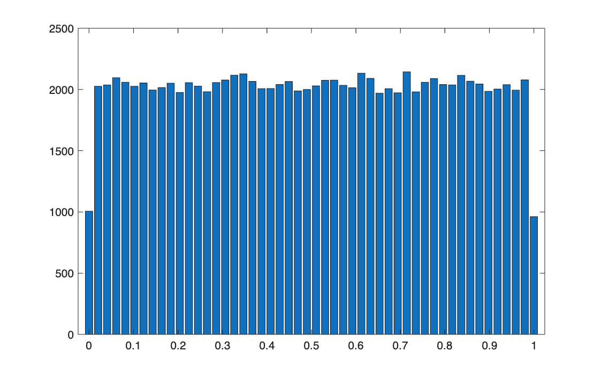
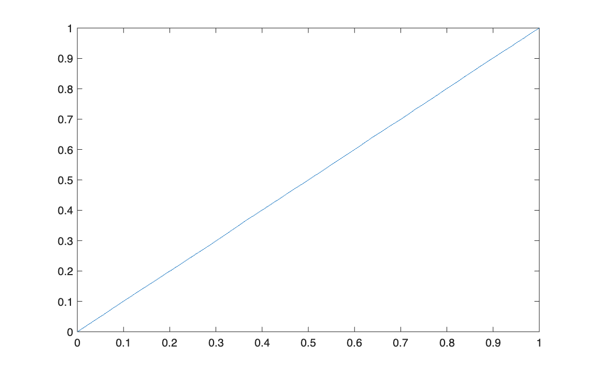

# The probability integral transform

<p class="ex-meta">Course exercise 146 · Part III</p>

## Problem

A function $\varphi$ is given as a black box. Feed it 100,000 standard normal draws, study the
distribution of the output (histogram, CDF, moments) and work out what $\varphi$ does.

## Method

The black box computes $\varphi(z) = \tfrac12\big(1 + \operatorname{erf}(z/\sqrt2)\big)$, which is
the standard normal CDF $\Phi(z)$. For any continuous random variable $Z$ with CDF $F$,

$$
U = F(Z) \sim U[0, 1]
$$

because $P(U \le u) = P(Z \le F^{-1}(u)) = F(F^{-1}(u)) = u$. This is the probability integral
transform, and read backwards ($Z = F^{-1}(U)$) it is how uniform random numbers are turned into
draws from any distribution.

## Code

=== "MATLAB"

    === "S_exercise_146.m"

        ```matlab
        --8<-- "computational-finance/part-3/probability-integral-transform/S_exercise_146.m"
        ```

    === "F_MCmethod.m"

        ```matlab
        --8<-- "computational-finance/part-3/probability-integral-transform/F_MCmethod.m"
        ```

=== "Python"

    === "S_exercise_146.py"

        ```python
        --8<-- "computational-finance/part-3/probability-integral-transform/S_exercise_146.py"
        ```

    === "F_Empirical_cdf.py"

        ```python
        --8<-- "computational-finance/part-3/probability-integral-transform/F_Empirical_cdf.py"
        ```

    === "F_Empirical_pdf.py"

        ```python
        --8<-- "computational-finance/part-3/probability-integral-transform/F_Empirical_pdf.py"
        ```

    === "F_MCmethod.py"

        ```python
        --8<-- "computational-finance/part-3/probability-integral-transform/F_MCmethod.py"
        ```

    === "F_SynteticIndices.py"

        ```python
        --8<-- "computational-finance/part-3/probability-integral-transform/F_SynteticIndices.py"
        ```


In MATLAB, the helper functions `F_Empirical_pdf`, `F_Empirical_cdf` and `F_SynteticIndices` are
the ones shown in [Part II](../../part-2/simulating-distributions/index.md).

## Results

| Output $Y$ | Sample | Uniform on [0, 1] |
|---|---:|---:|
| Mean | 0.4998 | 0.5 |
| Variance | 0.0831 | 0.0833 |
| Skewness | −0.0012 | 0 |
| Kurtosis | 1.8014 | 1.8 |

=== "Input: histogram"

    

=== "Input: CDF"

    

=== "Output: histogram"

    

=== "Output: CDF"

    

## Takeaways

- Applying a distribution's own CDF to its samples always gives a uniform: the output no longer
  carries any trace of the normal shape.
- The moments identify the result without looking at the code: a kurtosis of 1.8 and a variance
  of 1/12 are the signature of a uniform.
- The inverse direction is the practical one: it is how a Monte Carlo simulation produces draws
  from a distribution starting from uniform random numbers.
