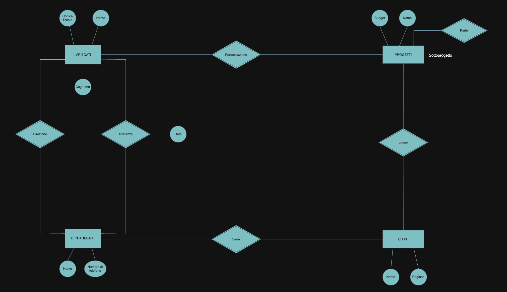
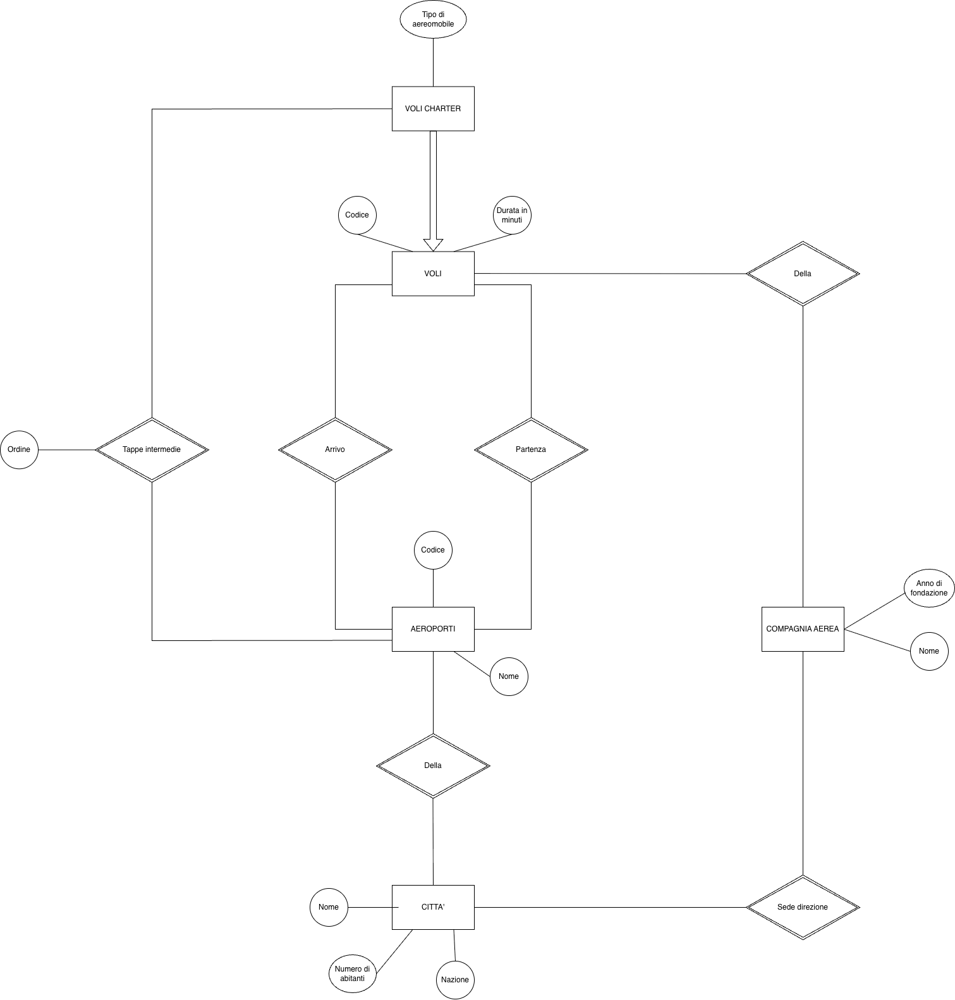
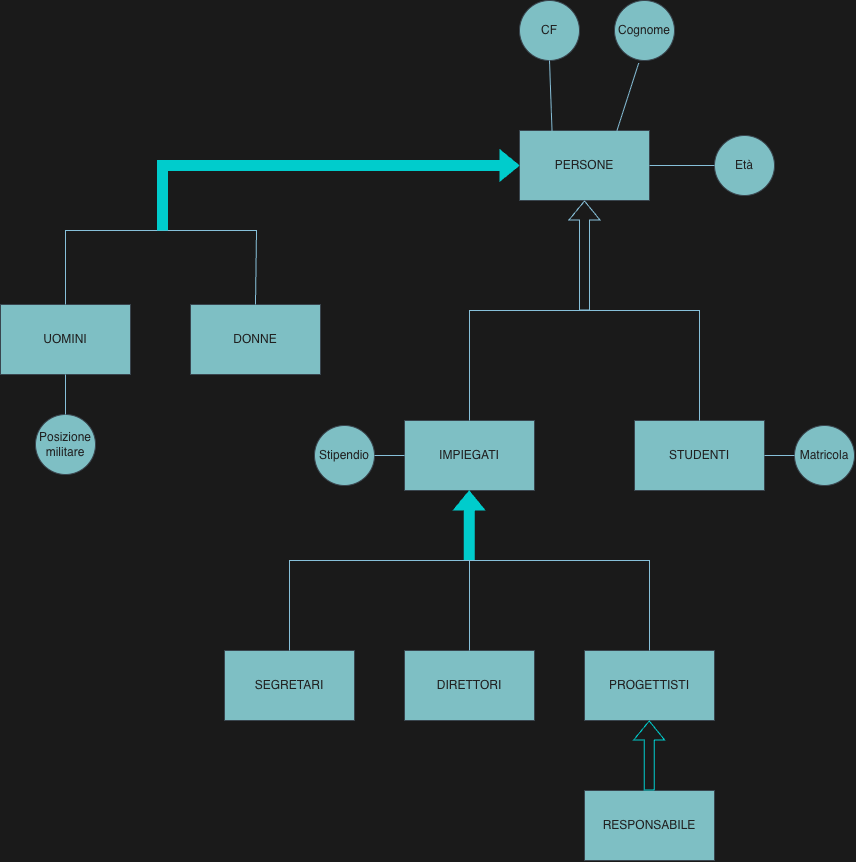
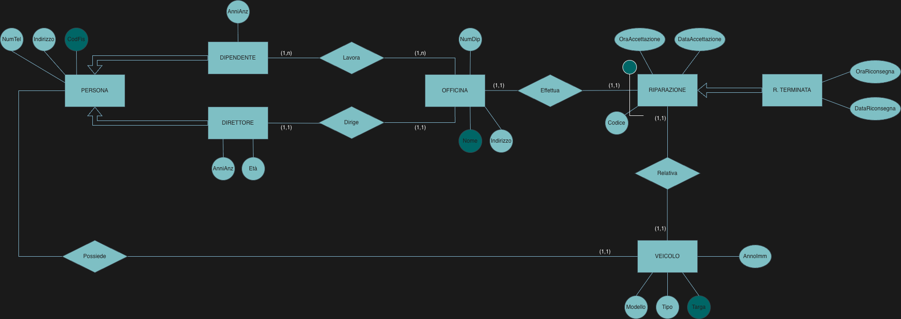
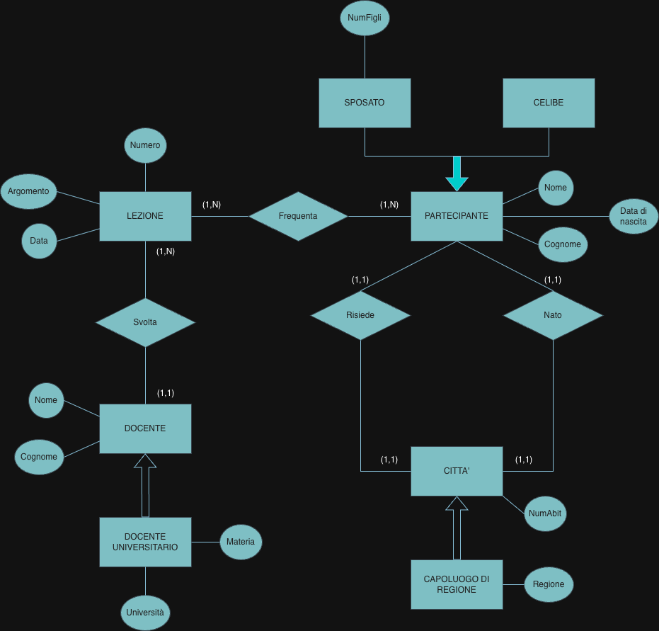
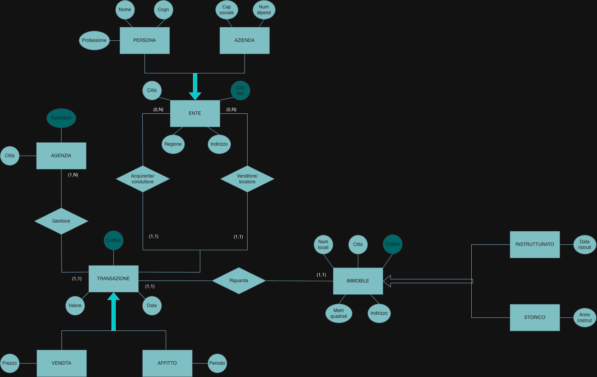
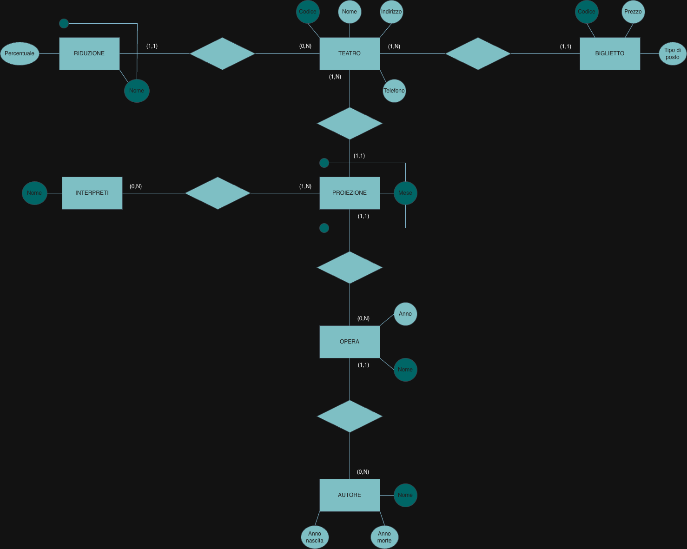

# Conceptual design: first schemas

Conceptual design · Part II

## Problem

Seven practice exercises: read a description of an application (in prose, or as a printed
document such as a theatre programme) and draw its Entity-Relationship schema. They follow
the order in which the notions were introduced: entities and relationships, then
generalizations, then identifiers and cardinalities.

## Method

1. **Nouns with their own properties** become entities; their properties, attributes.
2. **Links between entities** become relationships; a property of the link (a date, a
   price, a position) is an attribute of the relationship.
3. For each relationship, ask for **one** occurrence of each entity: with how many
   occurrences of the other can it be linked, at least and at most? That is the cardinality
   on its side.
4. **Identifiers**: a code, or an attribute plus the entity it depends on (external
   identifier: a repair number is unique only within its workshop).
5. **Generalizations** when some occurrences have extra properties: total if every parent
   belongs to a child, exclusive if to at most one.

The diagrams are drawn with draw.io: dark ellipses are identifiers, light ones plain
attributes; a line through a relationship ending in a dot marks an external identifier; a
thick filled arrow is a total generalization, a hollow arrow a partial one (or a subset).

## 1 · Employees, departments and projects

Employees (tax code, name, surname) belong to departments, with the date they joined, and
work on projects; projects have a name, a budget and the city where they take place, and can
be parts of other projects; departments have a name, a phone number, the employees who direct
them and the city of their office; cities have a name and a region.

The structure is right: a recursive relationship `Parte` with the role `Sottoprogetto`, and
the date on `Afferenza`, since it describes the link and not the employee. As the first
exercise of the series, it has neither cardinalities nor identifiers.

## 2 · Flights and charter flights

Flights have a code, a length in minutes, an airline, a departure and an arrival airport;
airports have a code, a name, a city (name and population) and a nation; airlines have a
name, a foundation year and the city of their headquarters. Charter flights are particular
flights with intermediate stops at airports, in a given order, and an aircraft type.

Charter flights are a subset of flights (hollow arrow): they inherit everything and add the
aircraft type and the stops. The order of the stops is an attribute of `Tappe intermedie`,
because it belongs to the pair (flight, airport). Cardinalities and identifiers are still
missing.

## 3 · Generalizations: persons, employees, students

Persons have a tax code, a surname and an age; men also have their military status; employees
have a salary and can be secretaries, managers or designers (a designer can also be project
leader); students (who cannot be employees) have a student number; some persons are neither.

Each kind of generalization is chosen correctly: men/women is total and exclusive (thick
arrow); employees/students is partial (some persons are neither) and exclusive; project leader
is a subset of designers.

!!! note "Review note"
    The generalization of employees into secretaries, managers and designers is drawn as
    total. The text says employees *can be* one of the three, which reads as partial: an
    employee may be none of them. The tax code is not marked as the identifier.

## 4 · Car repair workshops

Workshops have a name, an address, a number of employees, employees (with years of service)
and one director; each director runs exactly one workshop. Employees and directors have tax
code, address, phone numbers and seniority; directors also an age; a director may also be an
employee. Each repair is done by one workshop on one vehicle, with a code unique within the
workshop, acceptance date and time and, once finished, return date and time. Vehicles have
model, type, plate, registration year and one owner (tax code, address, phone numbers).

Good choices: a repair is identified by its code **and** its workshop; employees and directors
are two separate subsets of `PERSONA`, so the same person can be both; finished repairs are a
subset with the return date and time.

!!! note "Review notes"
    - Two cardinalities are reversed: a workshop carries out **many** repairs, so its side of
      `Effettua` is (0,N), not (1,1); likewise a vehicle can be repaired many times, so its
      side of `Relativa` is (0,N).
    - The person side of `Possiede` has no cardinality: (0,N).
    - The years of service of an employee belong on `Lavora` (they refer to that workshop),
      and are missing.
    - Phone numbers are plural: a multivalued attribute, cardinality (1,N).

## 5 · Course participants

Participants of a course: name, surname, date of birth, whether married and, if so, number of
children; the cities where they live and where they were born, with population, and the region
for regional capitals; the lessons they attended, each with a progressive number, topic and
day, and the lecturers who taught them (name, surname); for lecturers from a university, the
university and the subject they teach there.

Three generalizations, all appropriate: married participants with the number of children,
regional capitals with the region, university lecturers with university and subject.

!!! note "Review notes"
    - A city has many residents and many people born there: the city side of `Risiede` and
      `Nato` is (0,N), not (1,1).
    - A lecturer teaches more than one lesson: the lecturer side of `Svolta` is (1,N).
    - The progressive number is the identifier of a lesson. `CELIBE` adds nothing: a subset
      `SPOSATO` is enough.

## 6 · Property sales and rentals

Transactions (code, date, value) of sale and rental, carried out by agencies (number and
city), each about one property; properties (code, address, city, square metres, rooms), some
of historical interest (construction year), some renovated (date of the last renovation);
parties that buy, sell, rent out or rent, with tax code, address, city and region, which are
persons (name, surname, profession, city of birth) or companies (share capital, employees);
rentals have a period, sales a price.

A well-built schema: three generalizations of the right kind (parties into persons and
companies, transactions into sales and rentals, both total; properties into historical and
renovated, partial and possibly overlapping), and two relationships between transaction and
party for the two roles (buyer or tenant, seller or landlord).

!!! note "Review notes"
    A property can be the object of several transactions over time: its side of `Riguarda` is
    (1,N), not (1,1). The city of birth of persons is missing.

## 7 · Theatres, from their programme

The data come from a printed programme of two theatres: address, phone, ticket prices by seat
type, reductions (students 20%…), and for each play the author with years of birth and death,
the month and the main performers.

The performance (`PROIEZIONE`) is identified by theatre, play and month, which allows the same
play to return to the same theatre in another month; authors and performers are entities of
their own, as they recur across plays and theatres.

!!! note "Review notes"
    - The ticket price depends on the theatre **and** the seat type: rather than its own
      code, `BIGLIETTO` is better identified by the theatre plus the seat type.
    - With `RIDUZIONE` identified by name and theatre, "students" is repeated for every
      theatre. A shared entity of reduction types, linked to the theatres by a many-to-many
      relationship with the percentage as attribute, avoids it.

## Takeaways

- Attributes of a link (date of joining, order of a stop, years of service) go on the
  relationship, not on the entities.
- For each relationship, ask the cardinality question from **both** sides, with one
  concrete occurrence in mind: "this workshop, how many repairs?".
- Choose the kind of generalization from the wording: "are" means total, "can be" means
  partial; "cannot be both" means exclusive.
