# Conceptual design: exam questions

Conceptual design · Part II

## Problem

Six exam questions. Most come in two steps: draw the schema for the given requirements, then
**extend** it with new ones (keeping track of history, adding categories, ordered lists), often
stating the constraints that E-R cannot express. One question goes the other way: split a
four-way relationship into simpler ones.

## Method

The same as for the [first schemas](../conceptual-design-basics/index.md), plus three patterns
that recur in the extensions:

- **History over time**: a relationship that can hold several times between the same pair
  (an employee who returns to the same institute) becomes an **entity** identified by one side
  plus a start date.
- **Ordered list** (a curriculum of courses, an itinerary of works): a many-to-many relationship
  with a position attribute.
- **Derived information** (the department of a lecturer, when it follows from the degree
  programme): not drawn, otherwise the schema contains a redundancy.

## 1 · Professional training courses

**Requirements.** Courses (code, name, number of lessons, prerequisite courses); several
editions per course, each with start and end date, cost and one lecturer; lecturers (tax code,
name, surname, date and place of birth); each edition is made of lessons (date, start time,
length, description); editions are online (with the e-learning platform) or in person (with the
maximum number of students and the room).

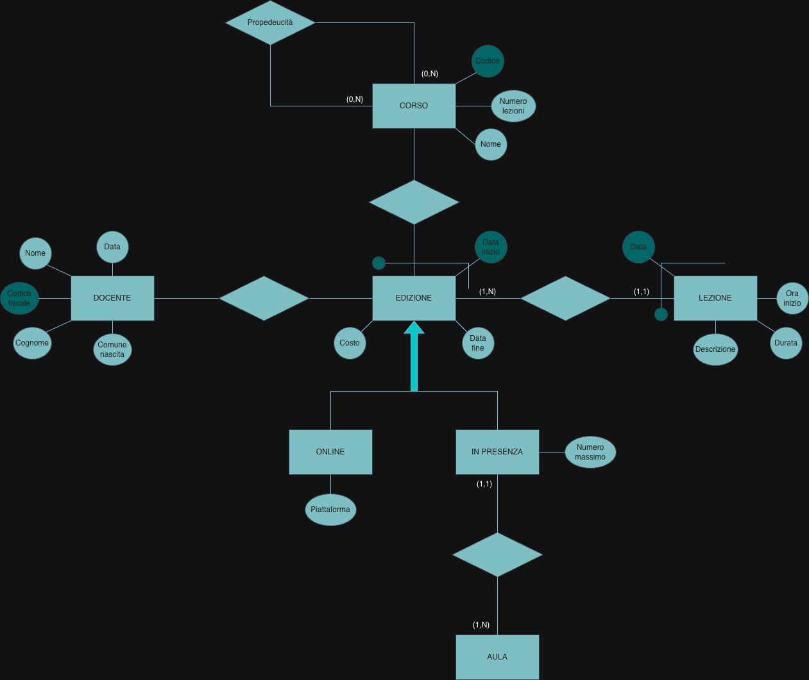

**Extension.** Lecturers are employees (hiring date) or contractors (VAT number, and they can
teach only in-person editions); curricula, each with a name and an ordered list of courses.

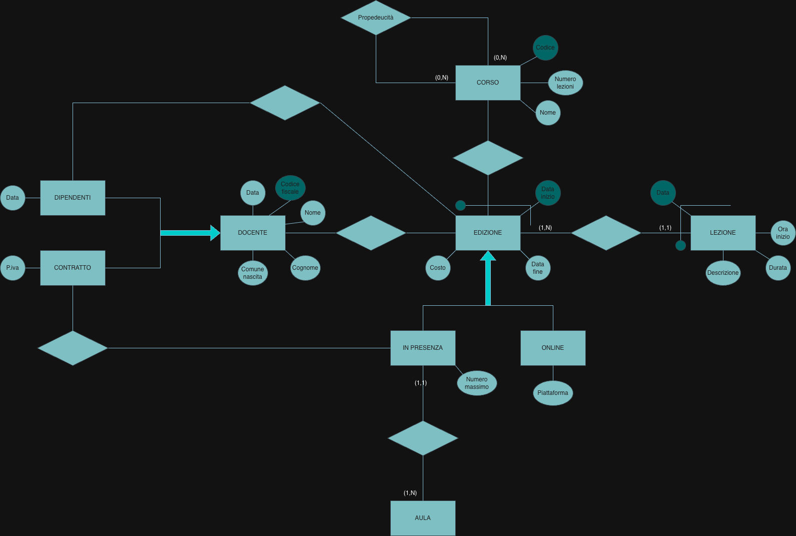

!!! note "Review notes"
    The base schema is good: editions identified by course and start date, lessons by edition
    and date, a total generalization online/in person, a recursive relationship for
    prerequisites. Points to fix:

    - the relationships of `EDIZIONE` with `CORSO` and `DOCENTE` have no cardinalities: the
      edition side is (1,1) in both, the course side (1,N), the lecturer side (0,N); `AULA`
      has no attributes (at least a name).
    - In the extension there are now three relationships for "who teaches an edition"
      (lecturer–edition, employee–edition, contractor–in person): they are redundant with each
      other. Either keep only the one with `DOCENTE` and write the constraint "contractors teach
      only in-person editions" beside the diagram, or keep only the two specific ones.
    - The **curricula** are missing: an entity `CURRICULUM` with its name, linked to `CORSO` by
      a many-to-many relationship with a position attribute.

## 2 · Lecturers, departments and faculties

**Requirements.** A first draft has one four-way relationship among lecturer, degree programme,
department and faculty. Split it according to three different sets of rules, with cardinalities.

=== "Version 1"

    Each lecturer teaches in exactly one degree programme; each programme has several lecturers
    and belongs to one department; each department to one faculty; a lecturer works only in the
    department and faculty of their programme.

    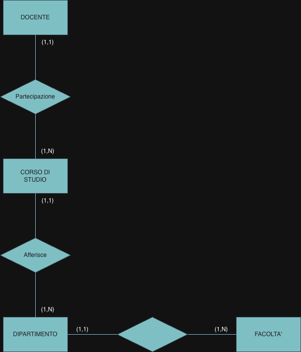

=== "Version 2"

    Each programme belongs to one faculty and has zero or more lecturers; each lecturer belongs
    to one faculty, works in one department and teaches in zero or more programmes (even of
    other faculties); a department interacts with the faculties and programmes of its lecturers.

    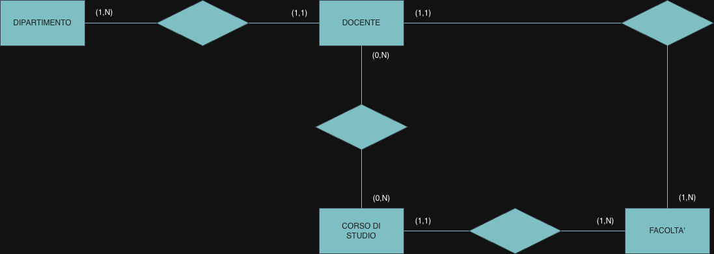

=== "Version 3"

    Each lecturer works in one department and teaches in all and only its programmes; each
    programme belongs to one department; each department to one faculty; a lecturer collaborates
    only with the faculty of their department.

    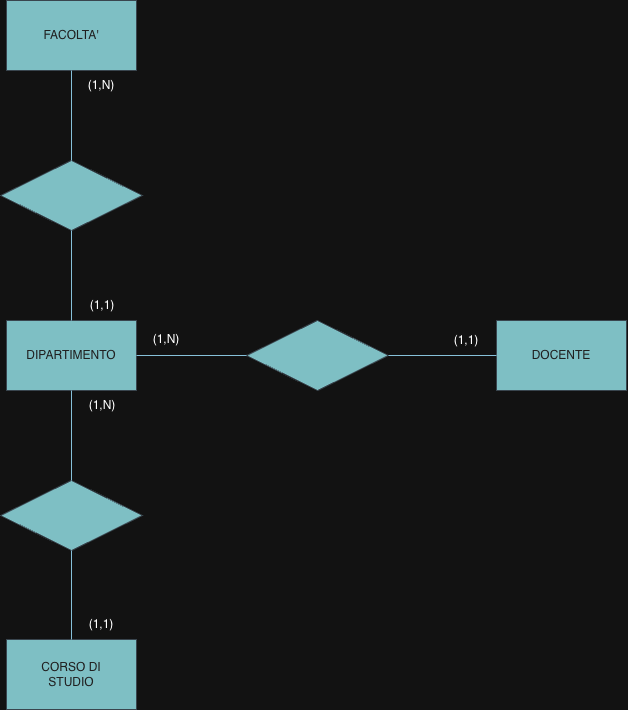

All three are correct. In each version, whatever follows from a chain of (1,1) relationships
(the department of a lecturer in version 1, the interactions of a department in version 2, the
programmes of a lecturer in version 3) is left out, because it can be derived.

## 3 · Museums

**Requirements.** Museums have a name and a city (with its nation, code and name) and a series of
rooms (name, size); they exhibit works of art with title, author (code, surname, name, dates of
birth and death, nation of birth), year, the room where the work is (fixed), and type (painting,
sculpture…). At least one identifier per entity, and all cardinalities.

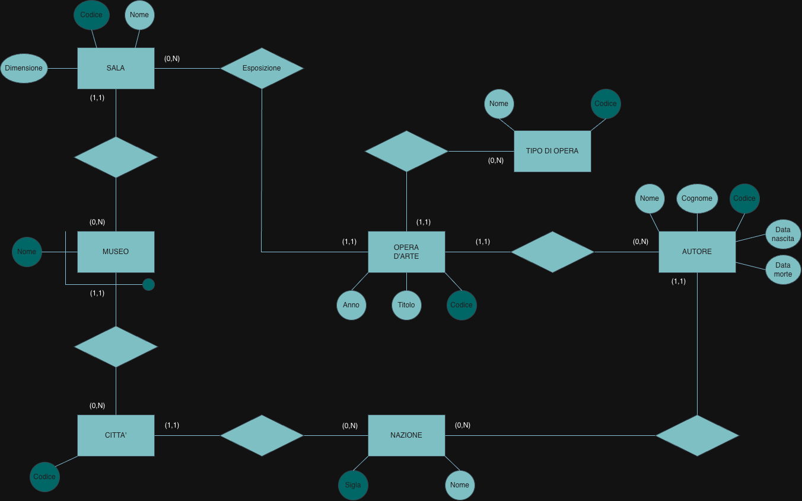

**Extension.** Visit itineraries, each of a museum, with a code unique within the museum and an
ordered list of works; guided tours with a name, start time and length, each based on an
itinerary and repeated on several weekdays with a different maximum number of participants.
State the constraints the schema cannot represent.

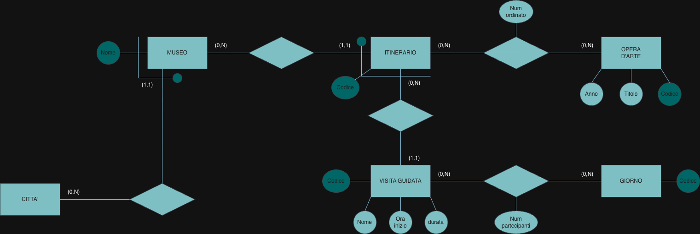

!!! note "Review notes"
    A very good schema: museums identified by name and city, itineraries by code and museum, the
    position in the itinerary on the relationship with the works, the maximum number of
    participants on the relationship between tour and weekday. Two details:

    - a museum "has a series of rooms": its side is (1,N) rather than (0,N); likewise an
      itinerary contains at least one work;
    - the constraint the question asks for is not written: *the works of an itinerary must be
      exhibited in rooms of the itinerary's museum*.

## 4 · Press review

**Requirements.** A press review collects newspaper articles of one day. Each article has a number,
a title and an author, and is published in one or more newspapers, possibly on a different page in
each; newspapers have a code and a name; authors a code, a name and an affiliation (a company);
affiliations a code and a name.

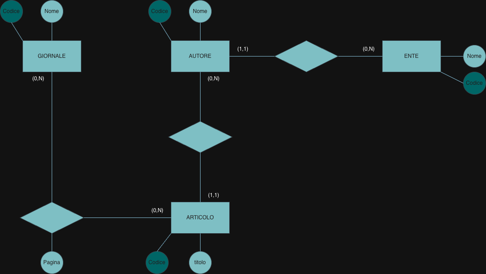

**Extension.** The review covers several days, each with the time it is produced and the name of its
curator; each article appears in the review of one day; for each article the author has an
affiliation and a role, which can change between articles (Mario Rossi wrote one article as CEO of
XXX SpA, another as chairman of YYY Srl).

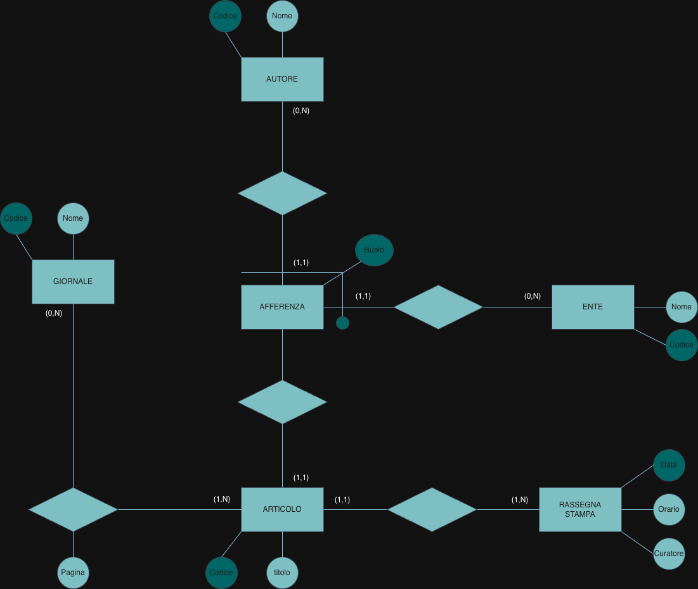

The key idea of the extension is right: the affiliation becomes an entity identified by author,
company and role, and each article points to the one valid when it was written.

!!! note "Review notes"
    In the base schema an article is published in **one or more** newspapers, so its side is
    (1,N) (fixed in the extension). In the extension, the `AFFERENZA` side of its relationship
    with `ARTICOLO` has no cardinality ((1,N), or (0,N)).

## 5 · Scientific institutes

**Requirements.** Institutes (code, name, foundation year, a city with code, name and nation) and the
researchers working there now: code, surname, name, date of birth, exactly one institute, exactly
one qualification from a predefined set.

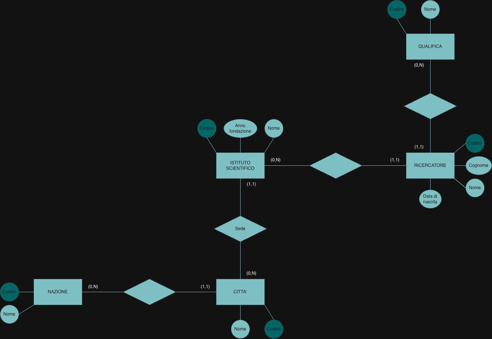

**Extension.** A researcher can change institute, and the history of affiliations matters (Mario Rossi
at XY from 2010 to 2012 and again from 2016, at WZ in between); qualifications change over time; each
researcher obtained a PhD at a university, which is an institute with the year it started awarding
PhDs.

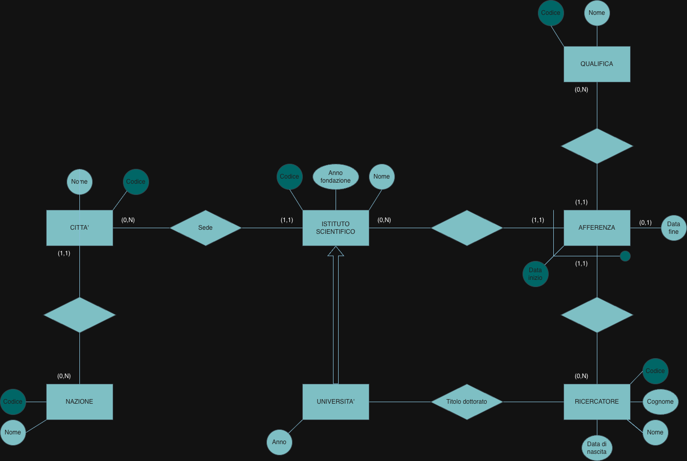

!!! note "Review notes"
    The base schema is correct, and the history of affiliations is modelled the right way: an
    entity identified by researcher and start date, with an optional end date, so the same
    institute can appear twice. Two points:

    - the qualification is attached to the affiliation, so it could change only together with
      the institute. It needs its own history: an entity identified by researcher and start date,
      with an end date and a (1,1) link to `QUALIFICA`;
    - `Titolo dottorato` has no cardinalities: (1,1) on the researcher, (0,N) on the university.

## 6 · The PNRR plan

**Requirements.** The Italian recovery plan (simplified): missions, with a number and a name, which
refer to zero or more recommendations of the European Commission (code and name) and are made of one
or more action lines; each action line has a progressive number unique within the mission, a name
and a budget.

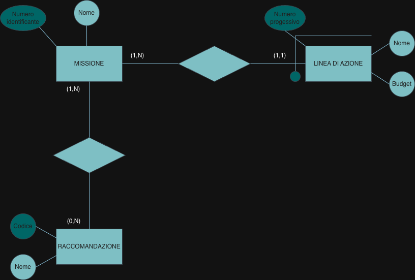

**Extension.** Action lines are funded by several sources (PNRR, React-EU, the complementary fund…),
with the amount from each; each line is split into projects with a code, a name, one coordinating
ministry and zero or more participating ministries; ministries have a code and a name.

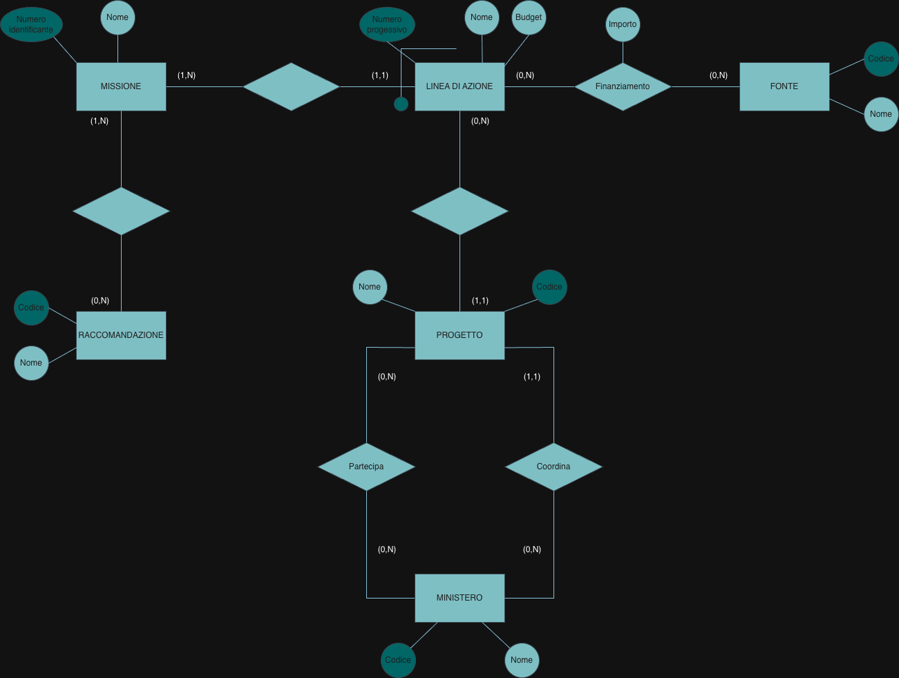

!!! note "Review notes"
    Correct structure: action lines identified by number and mission, the amount on the many-to-many
    relationship with the sources, two separate relationships for the coordinating and the
    participating ministries. One cardinality: a mission refers to **zero** or more
    recommendations, so its side is (0,N), not (1,N), in both schemas. A constraint worth stating:
    the coordinating ministry of a project is not also among its participants.

## Takeaways

- When a link can repeat over time, promote it to an entity identified by a date.
- Every piece of history needs its own entity: tying two histories together (institute and
  qualification) forces them to change together.
- Leave out what can be derived along a chain of (1,1) relationships.
- When the question asks for constraints outside E-R, write them: they are part of the answer.
