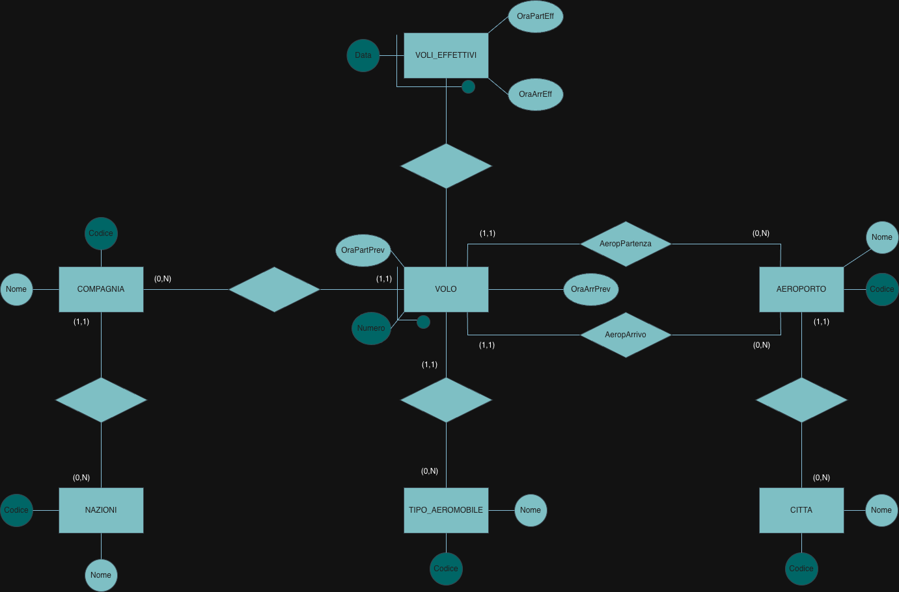
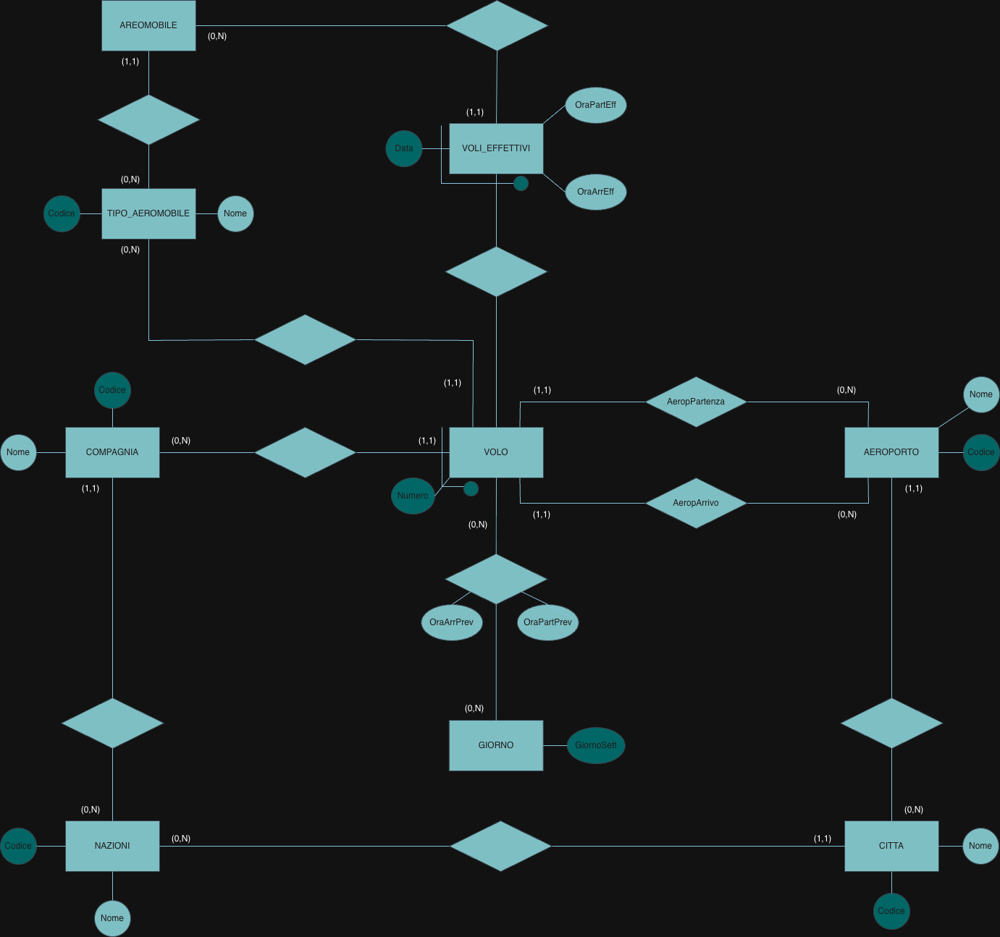
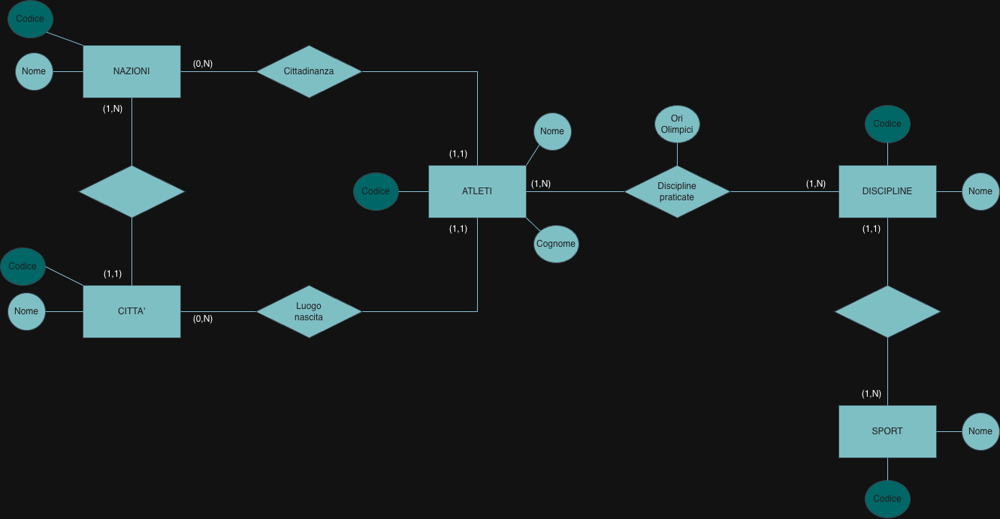
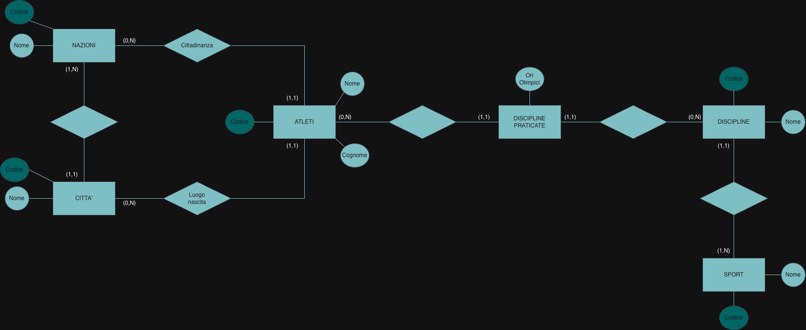
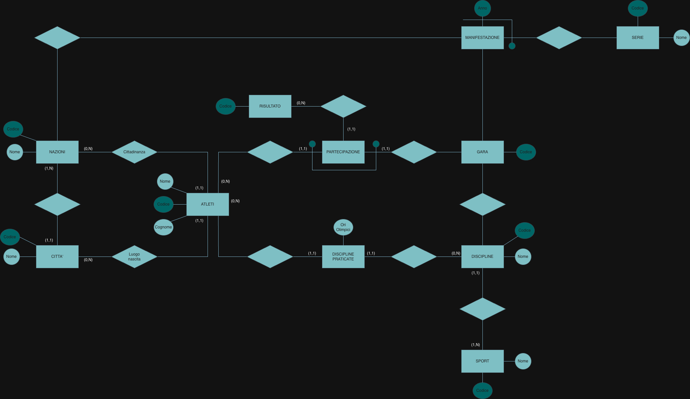
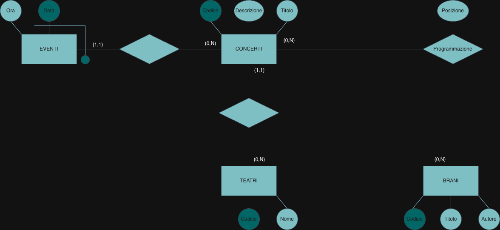
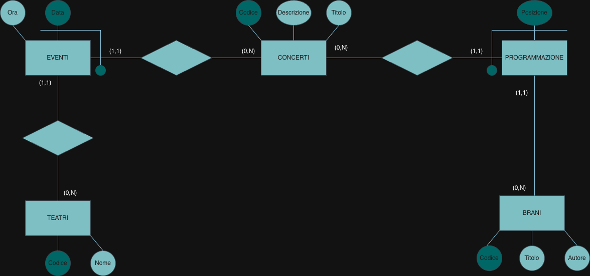
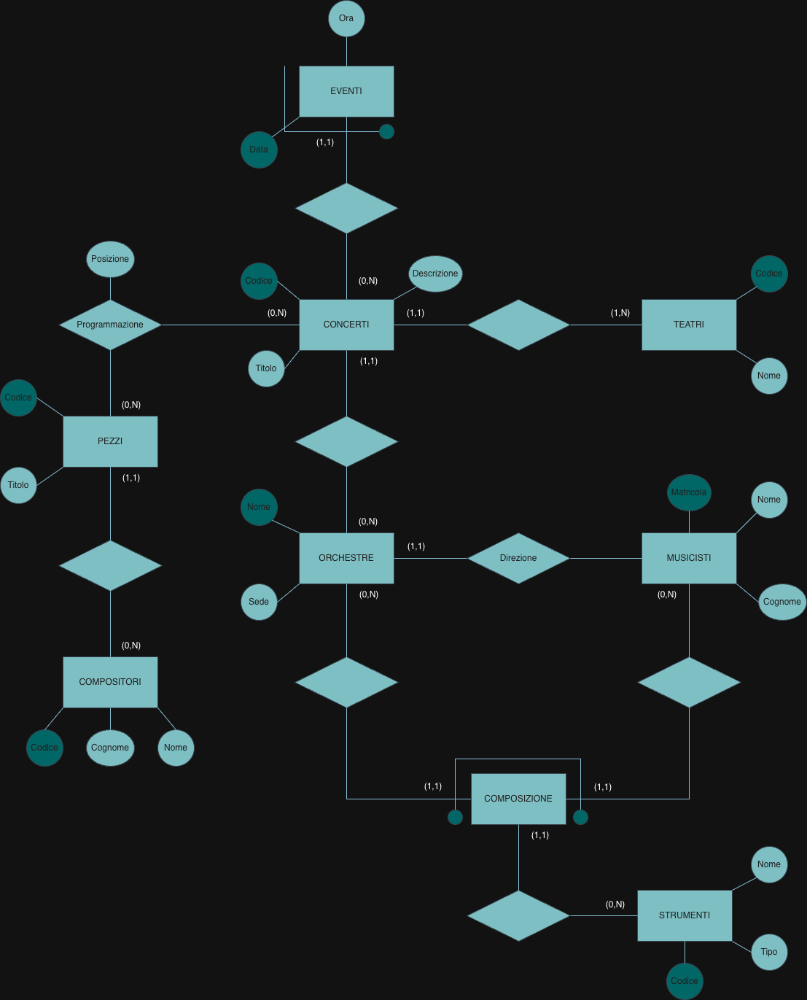
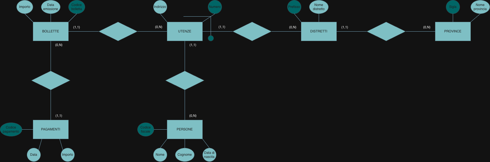

# Reverse engineering: from relational schema to E-R

Conceptual design · Part II

## Problem

The opposite of logical design: given a **relational schema** (tables, keys, referential
constraints), draw a conceptual schema whose translation would produce it; in some questions,
then extend that schema with new requirements. Four exams, five schemas.

## Method

Read each table and ask what it was before translation:

| In the relational schema | In the E-R schema |
|---|---|
| a table with its own key and no foreign key in the key | an **entity** |
| a foreign key outside the key | a **one-to-many relationship**: (1,1) on the side of the table that holds it, (0,N) on the other |
| a key made **only** of foreign keys | a **many-to-many relationship**; the other columns are its attributes |
| a key made of a foreign key **plus** a local attribute | a **weak entity**, identified externally through the relationship |

Minimum cardinalities on the "many" side are (0,N) unless the schema forces something more:
a relational schema cannot say that every theatre hosts at least one concert.

The diagrams are drawn with draw.io: dark ellipses are identifiers, light ones plain
attributes; a line through a relationship ending in a dot marks an external identifier.

## 1 · Airlines and flights

**Schema.** Nations; airlines (each of a nation); airports (each in a city); cities; flights,
identified by airline and number, with departure and arrival airport, scheduled times and
aircraft type; actual flights, identified by flight and date, with actual times; aircraft
types.

**Extension.** Each flight runs on one or more days of the week, with possibly different
times; individual aircraft matter, each with a code painted on the tail and a type; each
actual flight is operated by one aircraft, which must be of the type of the flight; each city
belongs to a nation. Also state any constraint the E-R model cannot express.

The scheduled times move from the flight to the relationship with `GIORNO`, because they can
change with the day.

!!! note "Review notes"
    The translation is correct, with its two weak entities (`VOLO`, identified by airline and
    number, and `VOLI_EFFETTIVI`, by flight and date). Points to complete:

    - the relationship between `VOLO` and `VOLI_EFFETTIVI` has no cardinalities: (1,1) on the
      actual flight, (0,N) on the flight;
    - in the extension, `AEROMOBILE` (spelled `AREOMOBILE`) has no attributes: the text gives
      it a code, which is its identifier; a flight runs on **one or more** days, so the
      `VOLO` side of the relationship with `GIORNO` is (1,N), not (0,N);
    - the constraint the question asks for is missing: *the aircraft of an actual flight must
      be of the type associated with that flight*. Two paths in the schema reach the
      aircraft type, and E-R cannot require them to agree.

## 2 · Athletes and disciplines

**Schema.** Nations; cities (each in a nation); athletes, with place of birth and citizenship;
the disciplines each athlete practises, with the number of Olympic gold medals in that
discipline; disciplines (each of a sport, for example the 100 metres in athletics); sports.

=== "With a relationship"

    

=== "With an entity"

    

The table `DisciplinePraticate(Atleta, Disciplina, OriOlimpici)` has a key made only of foreign
keys: it is a many-to-many relationship with the attribute `OriOlimpici`. The first diagram
says exactly this.

**Extension.** The individual races an athlete took part in matter, with the result (from a
list of predefined values, each with a code); each race belongs to an event (the 2024
Olympics), each event to a series (the Olympics); for each event, the nation and the year,
which identifies it within the series; each series has a code and a name.

!!! note "Review notes"
    `PARTECIPAZIONE` as an entity identified by athlete and race, with a link to `RISULTATO`,
    and `MANIFESTAZIONE` identified by year and series are the right structures. To complete:

    - in the second version of the base schema and in the extension, `DISCIPLINE PRATICATE`
      is an entity without an identifier: like `PARTECIPAZIONE`, it should be identified
      externally by its two relationships, or kept as a relationship as in the first version;
    - the relationships of `GARA` with `MANIFESTAZIONE` and `DISCIPLINE`, and those of
      `MANIFESTAZIONE` with `NAZIONI` and `SERIE`, have no cardinalities;
    - the question also asks for constraints outside E-R, which are not written down: for
      example, that the discipline of a race is one of those practised by its participants.

## 3 · Tracks, concerts and theatres

**Schema.** Tracks (with the author as a string); concerts, each in a theatre; theatres; the
programme of each concert (which track, in which position); events, identified by concert and
date, with a time.

**Extension.** The events of a concert may now take place in different theatres, and a track
may be repeated within a concert.

**Logical schema of the extension:**

- **Teatri**(<u>Codice</u>, Nome)
- **Eventi**(<u>Data</u>, <u>Concerti</u>, Ora, Teatro)
- **Concerti**(<u>Codice</u>, Descrizione, Titolo)
- **Programmazione**(<u>Concerti</u>, <u>Posizione</u>, Brani)
- **Brani**(<u>Codice</u>, Titolo, Autore)

The two changes are handled correctly: the theatre moves from the concert to the event; the
programme becomes an entity identified by concert and **position**, so the same track can
appear in two positions (the old key, concert and track, forbade it). The logical schema
follows; the referential constraints (`Teatro`, `Concerti`, `Brani`) are implied by the names
but not written.

## 4 · Concerts, orchestras and musicians

**Schema.** Pieces (each by a composer); composers; concerts, each with an orchestra and a
theatre; theatres; programme; events; orchestras (identified by name, with a seat and a
conductor who is a musician); musicians; the composition of each orchestra (which musician
plays which instrument); instruments.

!!! note "Review notes"
    Correct, including `COMPOSIZIONE` as an entity identified by musician and orchestra (a
    musician plays one instrument in a given orchestra). Two cardinalities: a theatre does not
    have to host a concert, so its side is (0,N), not (1,N); the musician side of `Direzione`
    is missing, and is (0,N).

## 5 · Utilities and bills

**Schema.** Utility contracts, identified by area code and number, with holder and address;
persons; districts (identified by area code, each in a province); provinces; bills (each for a
contract); payments (each for a bill).

Correct: the contract is a weak entity identified by its number and its district, which is how
the key (area code, number) arises; everything else is a chain of one-to-many relationships.

## Takeaways

- The key of a table tells what it was: only foreign keys → relationship; foreign key plus
  a local attribute → weak entity; its own code → entity.
- When a requirement says "can be repeated", the old key is what forbids it: change the
  identifier (here, concert + position instead of concert + track).
- E-R cannot say that two paths through the schema must lead to the same occurrence: such
  constraints are written beside the diagram.
