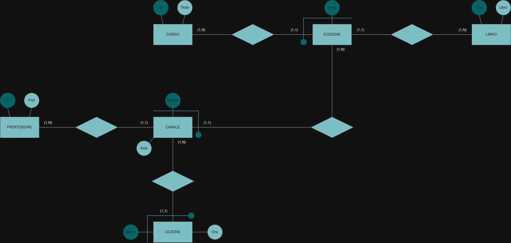

# Courses, channels and lessons

Normalization · Part III

## Problem

One relation holds courses, offered in several years and split into channels, with their
textbook, professor, room and weekly lessons:

| IDCorso | Titolo | Anno | CodLibro | Libro | Canale | IDProf | Prof | Aula | Giorno | Ora |
|---|---|---|---|---|---|---|---|---|---|---|
| C1 | Fisica | 2022 | L1 | Einstein | A-L | P1 | Rossi | 11 | Lu | 9:00 |
| C1 | Fisica | 2022 | L1 | Einstein | A-L | P1 | Rossi | 11 | Me | 11:00 |
| C1 | Fisica | 2022 | L1 | Einstein | M-Z | P2 | Neri | 12 | Lu | 9:00 |
| C1 | Fisica | 2022 | L1 | Einstein | M-Z | P2 | Neri | 12 | Gi | 9:00 |
| C1 | Fisica | 2021 | L2 | Fermi | A-L | P1 | Rossi | 13 | Ma | 10:00 |
| C2 | Chimica | 2022 | L3 | Avogadro | A-Z | P3 | Bruni | 14 | Gi | 11:00 |
| C2 | Chimica | 2021 | L4 | Avogadro | A-Z | P3 | Bruni | 14 | Gi | 11:00 |
| C3 | Meccanica | 2021 | L2 | Fermi | A-Z | P4 | Belli | 16 | Ma | 10:00 |

with the functional dependencies

- IDCorso → Titolo
- IDCorso, Anno → CodLibro
- IDCorso, Anno, Canale → IDProf, Aula
- IDCorso, Anno, Canale, Giorno → Ora
- CodLibro → Libro
- IDProf → Prof

Find the key, draw a conceptual schema without adding attributes, and decompose the relation
into BCNF, showing the tables with their data.

## Solution

**1 · Key.** Four attributes never appear on the right of an arrow: `IDCorso`, `Anno`, `Canale`,
`Giorno`. They must all be in the key, and together they determine everything else (through
the dependencies, every other attribute is reached). The key is
**(IDCorso, Anno, Canale, Giorno)**.

**2 · Conceptual schema.**

Each dependency becomes a level of a hierarchy of weak entities: a course has **editions**
(identified by course and year, with one textbook), an edition has **channels** (identified by
edition and channel, with a professor and a room), a channel has **lessons** (identified by
channel and day, with a time).

**3 · BCNF decomposition.** One table per dependency, with the left side as the key. The
original sheet gives the table structure with empty rows; the data below are the projections
of the example.

**Corso**

| <u>IDCorso</u> | Titolo |
|---|---|
| C1 | Fisica |
| C2 | Chimica |
| C3 | Meccanica |

**Edizione**

| <u>IDCorso</u> | <u>Anno</u> | CodLibro |
|---|---|---|
| C1 | 2022 | L1 |
| C1 | 2021 | L2 |
| C2 | 2022 | L3 |
| C2 | 2021 | L4 |
| C3 | 2021 | L2 |

**Libro**

| <u>CodLibro</u> | Libro |
|---|---|
| L1 | Einstein |
| L2 | Fermi |
| L3 | Avogadro |
| L4 | Avogadro |

**Canale**

| <u>Canale</u> | <u>IDCorso</u> | <u>Anno</u> | Aula | IDProf |
|---|---|---|---|---|
| A-L | C1 | 2022 | 11 | P1 |
| M-Z | C1 | 2022 | 12 | P2 |
| A-L | C1 | 2021 | 13 | P1 |
| A-Z | C2 | 2022 | 14 | P3 |
| A-Z | C2 | 2021 | 14 | P3 |
| A-Z | C3 | 2021 | 16 | P4 |

**Professore**

| <u>IDProf</u> | Prof |
|---|---|
| P1 | Rossi |
| P2 | Neri |
| P3 | Bruni |
| P4 | Belli |

**Lezione**

| <u>Giorno</u> | <u>Canale</u> | <u>IDCorso</u> | <u>Anno</u> | Ora |
|---|---|---|---|---|
| Lu | A-L | C1 | 2022 | 9:00 |
| Me | A-L | C1 | 2022 | 11:00 |
| Lu | M-Z | C1 | 2022 | 9:00 |
| Gi | M-Z | C1 | 2022 | 9:00 |
| Ma | A-L | C1 | 2021 | 10:00 |
| Gi | A-Z | C2 | 2022 | 11:00 |
| Gi | A-Z | C2 | 2021 | 11:00 |
| Ma | A-Z | C3 | 2021 | 10:00 |

Checked on SQLite: each dependency holds on the example data, and the natural join of the six
tables gives back exactly the eight original rows, so the decomposition loses no information.

The key, the schema and the decomposition are correct: each table has a key equal to the left
side of one dependency, so none of them violates BCNF, and the E-R hierarchy corresponds to
the tables one by one.

## Takeaways

- Attributes that are never determined by others must be in the key: start from them.
- Dependencies with growing left sides (course → course + year → + channel → + day) are a
  hierarchy of weak entities, each identified by its parent plus one attribute.
- After decomposing, check that the join gives back the original rows.
