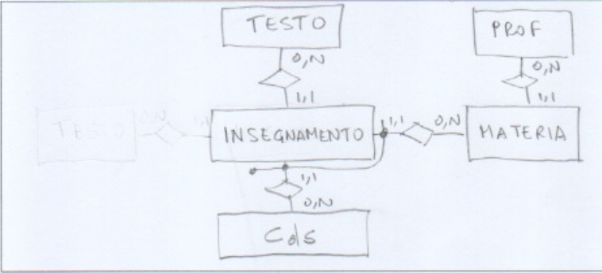
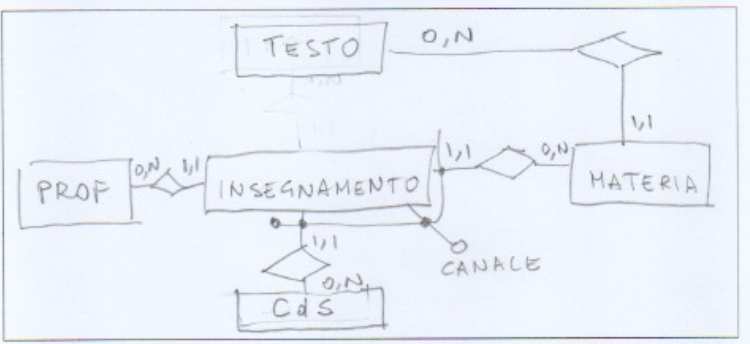
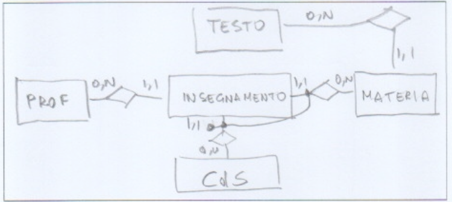
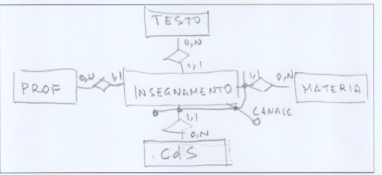
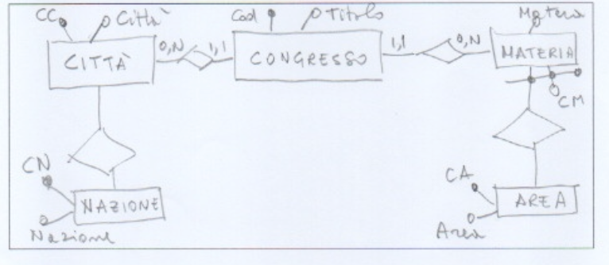
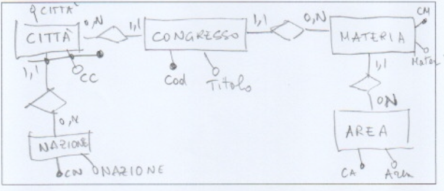
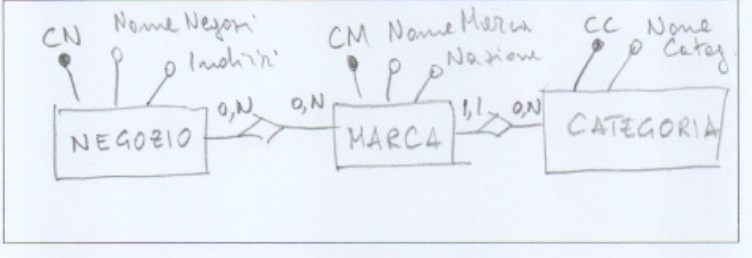
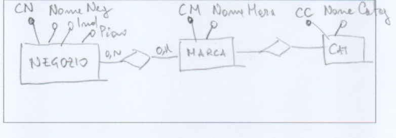

# A practice exam, solved by hand

Exam practice · Part III

## Problem

A complete written exam, in two versions (A and B) that change the details of each question,
solved on paper. Three questions:

1. **Restructuring an E-R schema** (35%): a first draft links professor, textbook, subject and
   degree programme with one four-way relationship `Insegnamento` (teaching). Promote it to an
   entity and add relationships, cardinalities and external identifiers, for four sets of rules.
2. **Normalizing scientific congresses** (35%): find the functional dependencies and the key,
   draw the conceptual schema and decompose into BCNF.
3. **Normalizing shops and brands** (30%): key, BCNF decomposition and conceptual schema.

## 1 · Restructuring the teaching relationship

Common rules: each teaching is about one subject, has one professor and is offered by one
degree programme; each professor holds zero or more teachings. What changes:

| | Who teaches a subject | Teachings of a subject in one programme | Textbook |
|---|---|---|---|
| A1 | always the same professor | at most one | one per teaching, can differ |
| A2 | possibly different professors | several, numbered by channel | one per subject |
| B1 | possibly different professors | at most one | one per subject |
| B2 | possibly different professors | several, numbered by channel | one per teaching, can differ |

=== "A1"

    

=== "A2"

    

=== "B1"

    

=== "B2"

    

All four are correct, and each rule lands in the right place:

- **the professor** is linked to the subject when every teaching of a subject has the same
  professor (A1), to the teaching otherwise;
- **the textbook** is linked to the subject when all its teachings share it (A2, B1), to the
  teaching otherwise;
- **the identifier** of a teaching is external: subject + degree programme when there is at most
  one per programme (A1, B1), plus the channel when there can be several (A2, B2).

## 2 · Scientific congresses

A relation `(Cod, Titolo, CC, Città, CN, Nazione, CM, Materia, CA, Area)`: each congress has a code
and a title and takes place in a city; cities have a code and a name and are in a nation; nations
have a code and a name; each congress is about a subject, which belongs to a scientific area; areas
have a code and a name. The two versions differ in which codes need context:

- **A**: the city code identifies a city; the subject code identifies it **only within its area**
  (M1 is ambiguous, the pair M1 A1 is not);
- **B**: the city code identifies a city **only within its nation**; the subject code identifies it.

=== "Version A"

    **Functional dependencies.** Cod → Titolo, CC, CM, CA · CC → Città, CN · CN → Nazione ·
    CM, CA → Materia · CA → Area. **Key:** Cod.

    

    **BCNF decomposition:** (<u>Cod</u>, Titolo, CC, CM, CA) · (<u>CC</u>, Città, CN) ·
    (<u>CN</u>, Nazione) · (<u>CM</u>, <u>CA</u>, Materia) · (<u>CA</u>, Area).

=== "Version B"

    **Functional dependencies.** Cod → Titolo, CC, CN, CM · CC, CN → Città · CN → Nazione ·
    CM → Materia, CA · CA → Area. **Key:** Cod.

    

    **BCNF decomposition:** (<u>Cod</u>, Titolo, CC, CN, CM) · (<u>CC</u>, <u>CN</u>, Città) ·
    (<u>CN</u>, Nazione) · (<u>CM</u>, Materia, CA) · (<u>CA</u>, Area).

The difference between the versions is handled consistently in all three answers: the code that
needs context gets a two-attribute left side in the dependencies, an external identifier in the
E-R schema (the subject identified with its area in A, the city with its nation in B) and a
two-column key in the decomposition. The congress does not link to the area directly: the area
follows from the subject, and a direct link would be redundant.

!!! note "Review note"
    In version A the relationships city–nation and subject–area have no cardinalities: (1,1) on
    the city and on the subject, (0,N) on the nation and on the area, as drawn in version B.

## 3 · Shops and brands

A relation `(CN, NomeNegozio, Indirizzo, CM, NomeMarca, Nazione, CC, NomeCategoria)` lists which
brands each shop sells, with the dependencies CN → NomeNegozio, Indirizzo · CM → NomeMarca,
Nazione, CC · CC → NomeCategoria. Version B adds the floor of the shop and drops the brand's
nation.

=== "Version A"

    **Key:** (CN, CM).
    **BCNF decomposition:** (<u>CN</u>, NomeNegozio, Indirizzo) · (<u>CM</u>, NomeMarca,
    Nazione, CC) · (<u>CC</u>, NomeCategoria) · (<u>CN</u>, <u>CM</u>).

    

=== "Version B"

    **Key:** (CN, CM).
    **BCNF decomposition:** (<u>CN</u>, NomeNegozio, Indirizzo, Piano) · (<u>CM</u>, NomeMarca,
    CC) · (<u>CC</u>, NomeCategoria) · (<u>CN</u>, <u>CM</u>).

    

Correct in both versions. Neither CN nor CM alone determines the other, so the key is the pair;
the table (CN, CM) that remains after extracting shops, brands and categories is exactly the
many-to-many relationship between shop and brand in the E-R schema.

!!! note "Review note"
    In version B the relationship between brand and category has no cardinalities: (1,1) on the
    brand, (0,N) on the category, as in version A.

## Takeaways

- Where a rule says "always the same", the attribute or link moves up to the entity that fixes it
  (the professor and the textbook on the subject).
- A code that is unique only in a context shows up three times: as a composite left side, as an
  external identifier and as a composite key. Check that all three agree.
- After a BCNF decomposition, the table made only of keys is the many-to-many relationship of the
  conceptual schema.
