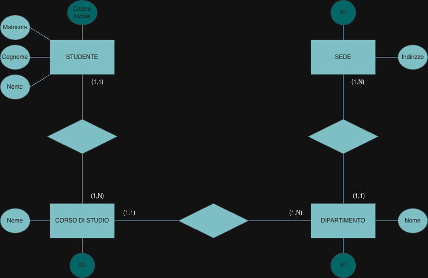

# Students, degree programmes and departments

Normalization · Part III

## Problem

One relation holds the data of a set of students, in non-normalized form:

| CodFisc | Matr | Cogn | Nome | IDCdS | NomeCdS | IDDip | NomeDip | IDSede | Indir |
|---|---|---|---|---|---|---|---|---|---|
| RSSMRA… | 101 | Rossi | Mario | C1 | Fisica | D1 | Scienze | S1 | Via Fermi |
| BLLLCU… | 102 | Belli | Lucia | C1 | Fisica | D1 | Scienze | S1 | Via Fermi |
| NREPLA… | 103 | Neri | Paolo | C2 | Chimica | D1 | Scienze | S1 | Via Fermi |
| NREMRA… | 103 | Neri | Maria | C3 | Ing Inf | D2 | Ing | S1 | Via Fermi |
| BRNMRA… | 104 | Bruni | Maria | C4 | Inglese | D3 | Lingue | S2 | Via Eliot |

with the functional dependencies

- CodFisc → Matr, Cogn, Nome, IDCdS
- Matr → CodFisc, Cogn, Nome, IDCdS
- IDCdS → NomeCdS, IDDip
- IDDip → NomeDip, IDSede
- IDSede → Indir

Find the keys (there are two), say which dependencies violate BCNF, draw a conceptual schema,
and decompose the relation into BCNF.

## Method

- **Keys.** An attribute set is a key if, following the dependencies, it determines every
  attribute, and no smaller set does. Attributes that never appear on the right of an arrow
  must be in every key.
- **BCNF.** A relation is in Boyce–Codd normal form if the left side of every non-trivial
  dependency is a superkey. Each dependency whose left side is not a key is a violation.
- **Decomposition.** Each violating dependency $X \to Y$ becomes its own table $(X, Y)$ with
  key $X$; $X$ stays in the original table as a foreign key.
- **From dependencies to E-R.** Every left side that identifies something (a student, a
  degree programme, a department, an office) is an entity; a dependency between identifiers
  (IDCdS → IDDip) is a one-to-many relationship.

## Solution

**1 · Keys.** `CodFisc` and `Matr` determine each other, and either of them determines the whole
chain: CodFisc → IDCdS → IDDip → IDSede → Indir. The two keys are **CodFisc** and **Matr**.

**2 · BCNF violations.**

| Dependency | Left side is a key? | Violates BCNF |
|---|---|---|
| CodFisc → Matr, Cogn, Nome, IDCdS | yes | no |
| Matr → CodFisc, Cogn, Nome, IDCdS | yes | no |
| IDCdS → NomeCdS, IDDip | no | **yes** |
| IDDip → NomeDip, IDSede | no | **yes** |
| IDSede → Indir | no | **yes** |

**3 · Conceptual schema.**

**4 · BCNF decomposition.**

| <u>CodFisc</u> | Matr | Cogn | Nome | IDCdS |
|---|---|---|---|---|
| RSSMRA | 101 | Rossi | Mario | C1 |
| BLLLCU | 102 | Belli | Lucia | C1 |

| <u>IDCdS</u> | NomeCdS | IDDip |
|---|---|---|
| C1 | Fisica | D1 |
| C2 | Chimica | D1 |

| <u>IDDip</u> | NomeDip | IDSede |
|---|---|---|
| D1 | Scienze | S1 |
| D2 | Ing | S1 |

| <u>IDSede</u> | Indir |
|---|---|
| S1 | Via Fermi |
| S2 | Via Eliot |

The text accepts "at least part of the data". Every table now has one subject, and each
department's name and office are written once instead of once per student.

!!! note "Review notes"
    The keys, the violations and the decomposition are correct. Two details:

    - `Matricola` is the second key, so in the E-R schema it should be marked as an
      identifier too (an alternative one), not as a plain attribute; in the first table it
      is a candidate key (`UNIQUE`).
    - The exam data contradict Matr → CodFisc: matricola 103 appears with two different tax
      codes (Paolo and Maria Neri). The dependencies are given as definitions, so the
      solution rightly follows them; it is most likely a typo in the text.

## Takeaways

- Two attributes that determine each other are two equivalent keys.
- A chain of dependencies (student → programme → department → office) breaks into one table
  per link, and maps one-to-one onto a chain of entities in E-R.
- The BCNF test only looks at the left side: is it a key?
